<div class="content">

Before we start programming, we will go through some principles of web development by examining an example application at **<https://227demo.djosv.com>**.

The application exists only to demonstrate some basic concepts of the course,
and is, by no means, an example of *how* a modern web application should be made.
On the contrary, it demonstrates some old techniques of web development, which could even be considered *bad practices* nowadays.

We will try to conform to contemporary best practices starting with [part 1](/part1).

Open the [example application](https://227demo.djosv.com) in your browser.
Sometimes this takes a while.

**The 1st rule of web development**: Always keep the Developer Console open on your web browser.
On macOS, open the console by pressing ***F12*** or ***option(⌥)-cmd(⌘)-I*** simultaneously.
On Windows or Linux, open the console by pressing ***F12*** or ***Ctrl-Shift-I***.
The console can also be opened via the [context menu](https://en.wikipedia.org/wiki/Menu_key).

Remember to ***always*** keep the Developer Console open when developing web applications.

The console looks like this:

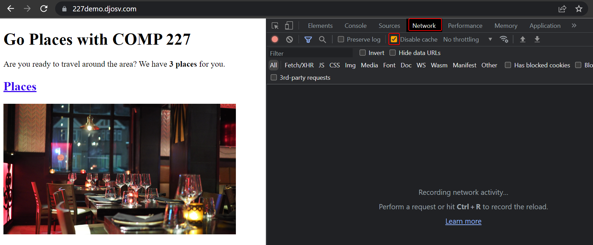

Make sure that the ***Network*** tab is open, and check the ***Disable cache*** option as shown.
*Preserve log* can also be useful: it saves the logs printed by the application when the page is reloaded.

**NB:** The most important tab is the ***Console*** tab.
However, in this introduction, we will be using the ***Network*** tab quite a bit.

### HTTP GET

The server and the web browser communicate with each other using the [HTTP](https://developer.mozilla.org/en-US/docs/Web/HTTP) protocol.
The *Network* tab shows how the browser and the server communicate.

When you reload the page (press the ***F5*** key or the &#8635; symbol on your browser),
the console will show that a few events have happened.

- The browser has fetched the contents of the page *comp227demo.pages.dev* from the server
- And has downloaded the image *travel.jpg*
- It also asked for the little icon that normally shows up next to your website's title in the tabs (favicon.ico).


On a small screen, you might have to widen the console window to see these.

Clicking the first event reveals more information on what's happening:

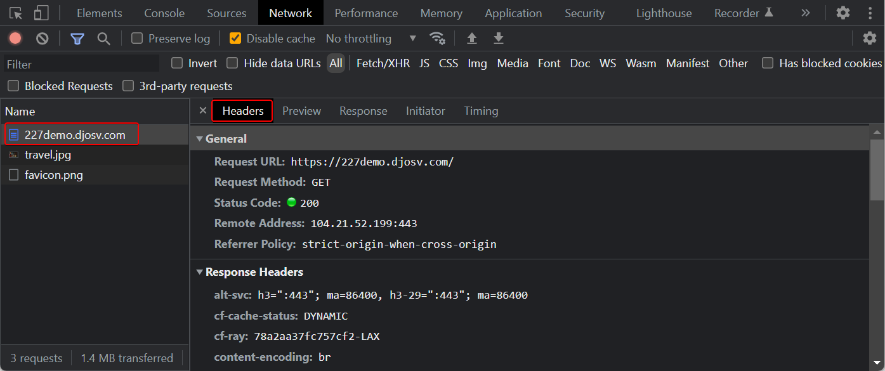

The upper part, ***General***, shows that the browser requested the address *<http://227demo.djosv.com>*
using the [GET](https://developer.mozilla.org/en-US/docs/Web/HTTP/Methods/GET) method.
That the request was successful
because the server response had the [Status code](https://en.wikipedia.org/wiki/List_of_HTTP_status_codes) 200.

The request and server response have several [headers](https://en.wikipedia.org/wiki/List_of_HTTP_header_fields):

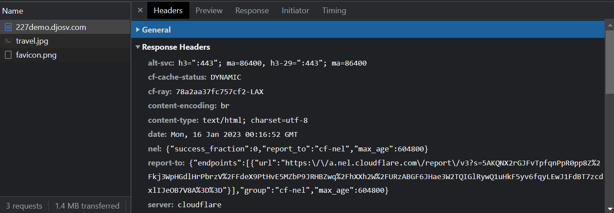

The **Response headers** on top tell us details like the true server and the exact time of the response.
An important header [Content-Type](https://developer.mozilla.org/en-US/docs/Web/HTTP/Headers/Content-Type)
tells us that the response is a text file in [UTF-8](https://en.wikipedia.org/wiki/UTF-8) format and the contents of which have been formatted with HTML.
This way the browser knows the response to be a regular [HTML](https://en.wikipedia.org/wiki/HTML) page and to render it to the browser 'like a web page'.

The **Response** tab shows the response data, a regular HTML page.
The **body** section determines the structure of the page rendered to the screen:


The page contains a [div](https://developer.mozilla.org/en-US/docs/Web/HTML/Element/div) element which in turn contains:

- a heading (`h1`)
- A paragraph with text.
- a link to our ***actual demo***
- an [img](https://developer.mozilla.org/en-US/docs/Web/HTML/Element/img) tag

Because of the `img` tag, the browser does a second *HTTP request* to fetch the image *travel.jpg* from the server.
The details of the request are as follows:


The request was made to the address <https://227demo.djosv.com/travel.jpg> and its type is *HTTP GET*.
The response headers tell us that the response size is 1396589 bytes (fairly large!),
and its [Content-type](https://developer.mozilla.org/en-US/docs/Web/HTTP/Headers/Content-Type) is *image/jpeg*,
so it is a png image.
The browser uses this information to render the image correctly to the screen.

The chain of events caused by opening the page <https://227demo.djosv.com>
on a browser from the following [sequence diagram](https://www.geeksforgeeks.org/unified-modeling-language-uml-sequence-diagrams/):


First, the browser sends an HTTP GET request to the server to fetch the HTML code of the page.
The ***img*** tag in the HTML prompts the browser to fetch the image *travel.jpg*.
The browser renders the HTML page and the image to the screen.

Even though it is difficult to notice, the HTML page begins to render before the image has been fetched from the server.

### Traditional web applications

The homepage of the example application works like a **traditional web application**.
When entering the page, the browser fetches the HTML document detailing the structure and the textual content of the page from the server.

The server has formed this document somehow.
The document can be a *static* text file saved into the server's directory.
The server can also form the HTML documents *dynamically* according to the application code, using, for example, data from a database.
The HTML code of the example application has been formed dynamically because it contains information on the number of created places.

A simplified version of the HTML page is below:

```js
const getFrontPageHtml = (placeCount) => {
  return(`
    <!DOCTYPE html>
    <html>
      <head>
      </head>
      <body>
        <div class='container'>
          <h1>Go Places with COMP 227</h1>
          <p>We have ${placeCount} places for you.</p>
          <a href='/places'>Places</a>
          
        </div>
      </body>
    </html>
`)
} 

app.get('/', (req, res) => {
  const page = getFrontPageHtml(places.length)
  res.send(page)
})
```

You don't have to understand the code just yet.

The content of the HTML page has been saved as a template string or a string that allows for evaluating, for example, variables in the midst of it.
The dynamically changing part of the homepage, the number of saved places (in the code `placeCount`),
is replaced by the current number of places (in the code `places.length`) in the template string.

Writing HTML amid the code is of course not smart, but for PHP programmers, it was a normal practice.

In traditional web applications, the browser is "dumb".
It only fetches HTML data from the server, and all application logic is on the server.
A server can be created using many different technologies such as:

- [Java Spring](https://spring.io/learn)
- [Python Flask](https://www.fullstackpython.com/flask.html)
- [Ruby on Rails](http://rubyonrails.org/)

Our example uses the [Express](https://expressjs.com/) library with Node.js.
This course will use Node.js and Express to create web servers.

### Running application logic in the browser

Keep the Developer Console open.
Empty the console by clicking the 🚫 symbol, or by typing `clear()` in the console.
Now when you go to the [places](https://227demo.djosv.com/places) page, the browser does 4 HTTP requests:


All of the requests have *different* types.
The first request type is of type **document**.
It is the HTML code of the page, and it looks as follows:

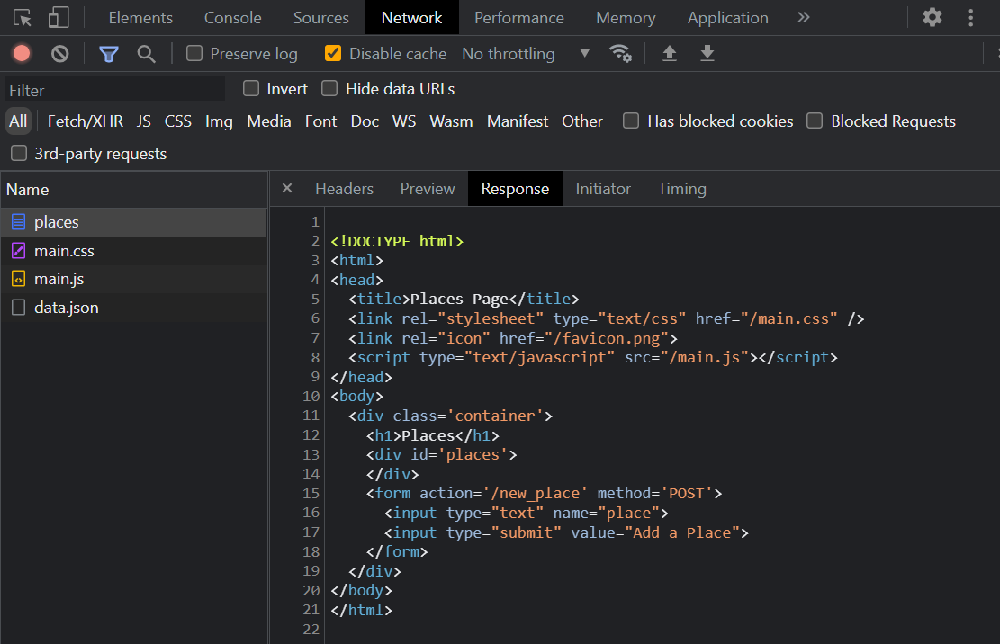

When we compare the page shown on the browser and the HTML code returned by the server, we notice that the code does not contain the list of places.
The [`head`](https://developer.mozilla.org/en-US/docs/Web/HTML/Element/head) section of the HTML contains a
[`script`](https://developer.mozilla.org/en-US/docs/Web/HTML/Element/script) tag.
`script` causes the browser to fetch a JavaScript file called *main.js*.

The JavaScript code looks as follows:

```js
var xhttp = new XMLHttpRequest()

xhttp.onreadystatechange = function() {
  if (this.readyState == 4 && this.status == 200) {
    const data = JSON.parse(this.responseText)
    console.log(data)

    var ul = document.createElement('ul')
    ul.setAttribute('class', 'places')

    data.forEach(function(place) {
      var li = document.createElement('li')

      ul.appendChild(li)
      li.appendChild(document.createTextNode(place.name))
    })

    document.getElementsByClassName('places').appendChild(ul)
  }
}

xhttp.open('GET', '/data.json', true)
xhttp.send()
```

The details of the code are not important right now, but some code has been included to spice up the images and the text.
We will properly start coding in [part 1](/part1).
The sample code in this part is *not relevant at all* to the coding techniques of this course.

> Some might wonder why `xhttp` object is used instead of the modern `fetch`.
  This is because we don't want to get into promises at all yet, and the code having a secondary role in this part.
  We'll discuss savvier ways to make requests to the server in part 2.

Immediately after fetching the `script` tag, the browser begins to execute the code.

The last two lines instruct the browser to do an HTTP GET request to the server's address */data.json*:

```js
xhttp.open('GET', '/data.json', true)
xhttp.send()
```

This is the bottom-most request shown on the Network tab.

We can try going to the address <https://227demo.djosv.com/data.json> straight from the browser:


There we find the places in [JSON](https://en.wikipedia.org/wiki/JSON) "raw data".
By default, Chromium-based browsers are not too good at displaying JSON data.
Plugins can be used to handle the formatting.
Install, for example, [JSONVue](https://chrome.google.com/webstore/detail/jsonview/chklaanhfefbnpoihckbnefhakgolnmc) on Chrome, and reload the page.
The data is now nicely formatted:


So, the JavaScript code of the places page above downloads the JSON data containing the places, and forms a bullet-point list from the names of places:

This is done by the following code:

```js
const data = JSON.parse(this.responseText)
console.log(data)

var ul = document.createElement('ul')
ul.setAttribute('class', 'places')

data.forEach(function(place) {
  var li = document.createElement('li')

  ul.appendChild(li)
  li.appendChild(document.createTextNode(place.name))
})

document.getElementById('places').appendChild(ul)
```

The code first creates an unordered list with a [ul](https://developer.mozilla.org/en-US/docs/Web/HTML/Element/ul) tag...

```js
var ul = document.createElement('ul')
ul.setAttribute('class', 'places')
```

...and then adds one [li](https://developer.mozilla.org/en-US/docs/Web/HTML/Element/li) tag for each place.
Only the `name` field of each place becomes the contents of the `li` tag.
The timestamps found in the raw data are not used for anything here.

```js
data.forEach(function(place) {
  var li = document.createElement('li')

  ul.appendChild(li)
  li.appendChild(document.createTextNode(place.name))
})
```

Now open the ***Console*** tab on your Developer Console:


By clicking the little triangle at the beginning of the line, you can expand the text on the console.

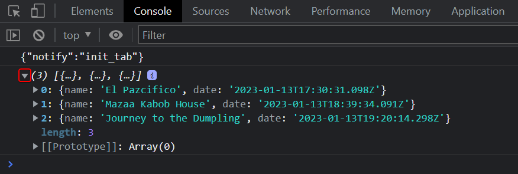

This output on the console is caused by the `console.log` command in the code:

```js
const data = JSON.parse(this.responseText)
console.log(data)
```

So, after receiving data from the server, the code prints it to the console.

The ***Console*** tab and the `console.log` command will become very familiar to you during the course.

### Event handlers and Callback functions

The structure of this code is a bit odd:

```js
var xhttp = new XMLHttpRequest()

xhttp.onreadystatechange = function() {
  // code that takes care of the server response
}

xhttp.open('GET', '/data.json', true)
xhttp.send()
```

The request to the server is sent on the last line, but the code to handle the response can be found further up.
What's going on?

```js
xhttp.onreadystatechange = function () {
```

On this line, an **event handler** for the event `onreadystatechange` is defined for the `xhttp` object doing the request.
When the state of the object changes, the browser calls the event handler function.
The function code checks:

- that the [readyState](https://developer.mozilla.org/en-US/docs/Web/API/XMLHttpRequest/readyState) equals 4
    - which depicts the situation *The operation is complete*
- that the HTTP status code of the response is 200.

```js
xhttp.onreadystatechange = function() {
  if (this.readyState == 4 && this.status == 200) {
    // code that takes care of the server response
  }
}
```

The mechanism of invoking event handlers is very common in JavaScript.
Event handler functions are called [callback](https://developer.mozilla.org/en-US/docs/Glossary/Callback_function) functions.
The application code does not invoke the functions itself, but the runtime environment.
The *browser invokes* the function at an appropriate time when the **event** has occurred.

### Document Object Model or DOM

We can think of HTML pages as implicit tree structures.

```text
html
  head
    link
    script
  body
    div
      h1
      div
        ul
          li
          li
          li
      form
        input
        input
```

The same treelike structure can be seen on the console tab ***Elements***.


The functioning of the browser is based on the idea of depicting HTML elements as a tree.

Document Object Model, or [DOM](https://en.wikipedia.org/wiki/Document_Object_Model),
is an Application Programming Interface (**API**).
The DOM enables programmatic modification of the **element trees** corresponding to web pages.

The JavaScript code introduced in the previous chapter used the DOM-API to add a list of places to the page.

The following code creates a new node to the variable `ul`, and adds some child nodes to it:

```js
var ul = document.createElement('ul')

data.forEach(function(place) {
  var li = document.createElement('li')

  ul.appendChild(li)
  li.appendChild(document.createTextNode(place.name))
})
```

Finally, the tree branch of the `ul` variable is connected to its proper place in the HTML tree of the whole page:

```js
document.getElementsByClassName('places').appendChild(ul)
```

### Manipulating the document object from console

The topmost node of the DOM tree of an HTML document is called the `document` object.
We can perform various operations on a webpage using the DOM-API.
You can access the `document` object by typing `document` into the Console tab:

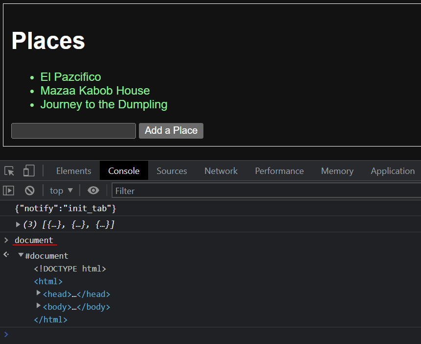

Let's add a new place to the page ***directly from the console***.

First, we'll get the list of places from the page.
The list is in the first `ul` element of the page:

```js
list = document.getElementsByTagName('ul')[0]
```

Then create a new `li` element and add some text content to it:

```js
newElement = document.createElement('li')
newElement.textContent = 'Page manipulation straight from the console is easy'
```

And add the new `li` element to the list:

```js
list.appendChild(newElement)
```

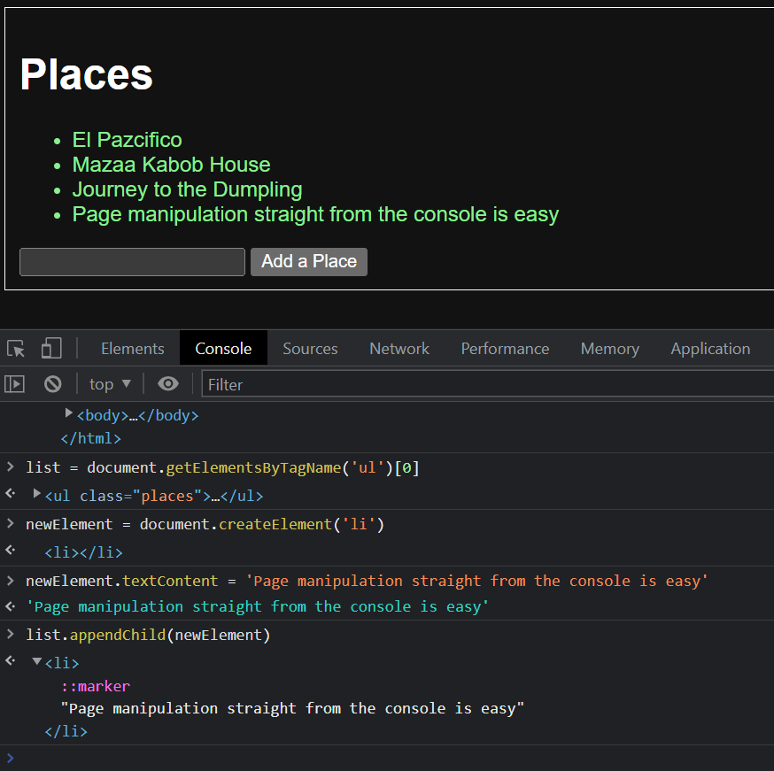

> *Side note (optional)* - If you are studying the pictures closely you may see that there is this additional `::marker` that got placed into the li tag.
> This is a pseudo-marker generated by chrome to represent the bullet next to the list item and is present because we are styling the bullet list.
> It has no bearing and does not appear in the html tag, but it's present to help us understand how items are being styled in the developer tools.

Even though the page updates on your browser, the changes are not permanent.
If the page is reloaded, the new place will disappear, because the changes were not pushed to the server.
The JavaScript code the browser fetches will always create the list of places based on JSON data from the address <https://227demo.djosv.com/data.json>.

### CSS

The `head` element of the HTML code of the Places page contains a [link](https://developer.mozilla.org/en-US/docs/Web/HTML/Element/link) tag.
This `link` tag determines that the browser must fetch a [CSS](https://developer.mozilla.org/en-US/docs/Web/CSS)
style sheet from the address [main.css](https://227demo.djosv.com/main.css).

Cascading Style Sheets, or CSS, is a style sheet language used to determine the appearance of web pages.

The fetched CSS file looks as follows:

```css
:root {
  color-scheme: dark;
}

.container {
  padding: 10px;
  border: 1px solid
}

body {
  font-family: sans-serif;
}

.places {
  color: lightgreen;
}
```

The file defines:

- two [class selectors](https://developer.mozilla.org/en-US/docs/Web/CSS/Class_selectors) (*`.container`* and *`.places`*)
- one [type selector](https://developer.mozilla.org/en-US/docs/Web/CSS/Type_selectors)(*`body`*)
- one [pseudo-class selector](https://developer.mozilla.org/en-US/docs/Web/CSS/Pseudo-classes) (*`:root`*)

The **class selectors** are used to select certain parts of the page and to define styling rules to style them.
The type and pseudo-class selectors are merely present to switch the component to look closer to a dark mode equivalent (and to make it .1% more stylish).
Those two are not as important to our current discussion.

A class selector definition always starts with a period and contains the name of the class.

The classes can be applied to HTML elements as [**attributes**](https://developer.mozilla.org/en-US/docs/Web/HTML/Global_attributes/class).

CSS attributes can be examined on the ***Elements*** tab of the console:  

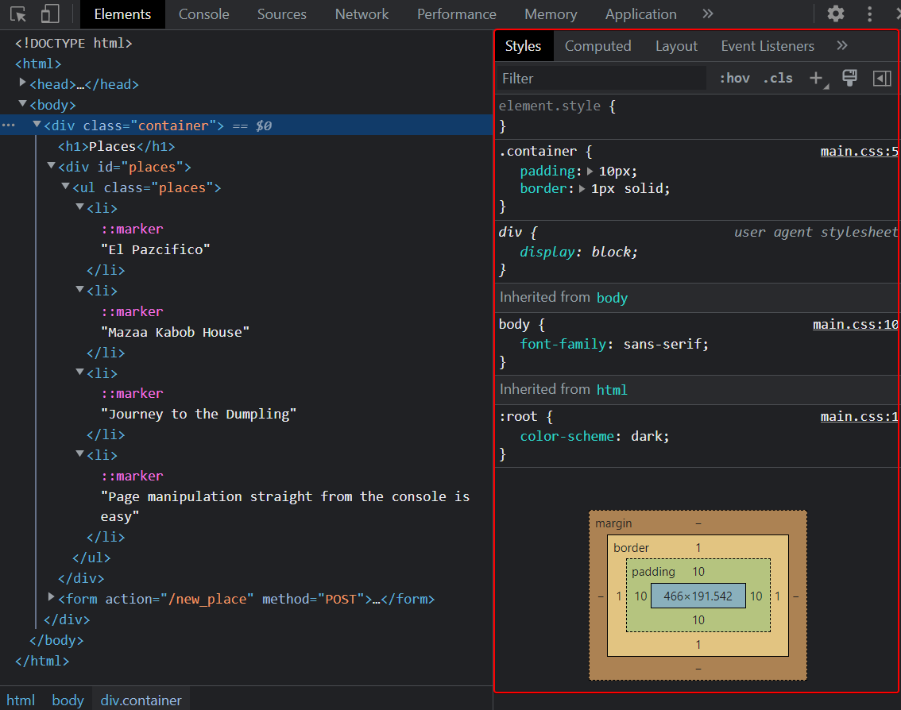

The outermost `div` element has the class `container`.
The `ul` element containing the list of places has the class `places`.

The CSS rule defines that elements with the `container` class will be outlined with a one-pixel wide [border](https://developer.mozilla.org/en-US/docs/Web/CSS/border).
It also sets 10-pixel [padding](https://developer.mozilla.org/en-US/docs/Web/CSS/padding) on the element.
This adds some space between the element's content and the border.

The `.places` CSS rule sets the text color as `lightgreen`.

HTML elements can also have other attributes apart from classes.
The `div` element containing the places has an [id](https://developer.mozilla.org/en-US/docs/Web/HTML/Global_attributes/id) attribute.
JavaScript code uses the id to find the element.

The ***Elements*** tab of the console can be used to change the styles of the elements.

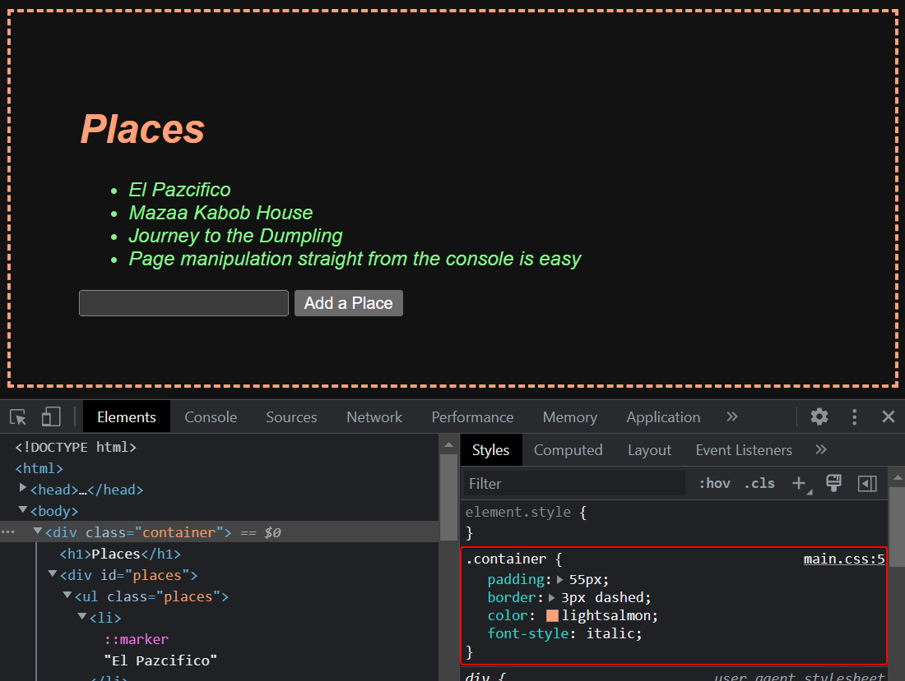

Changes made on the console will not be permanent.
If you want to make lasting changes, they must be saved to the CSS style sheet on the server.

### Loading a page containing JavaScript - review

Let's review what happens when the page <https://227demo.djosv.com/places> is opened on the browser.

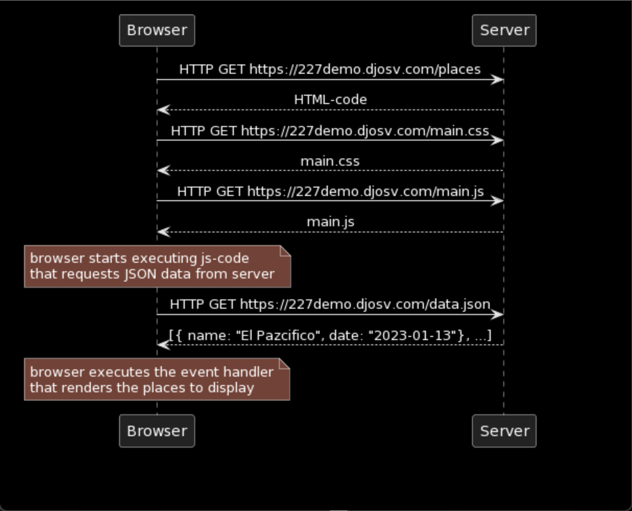

- The browser fetches the HTML code defining the content and the structure of the page from the server using an HTTP GET request.
- Links in the HTML code cause the browser to also fetch the CSS style sheet *main.css*...
- ...and a JavaScript code file *main.js*
- The browser executes the JavaScript code.
  The code makes an HTTP GET request to the address <https://227demo.djosv.com/data.json>, which
  returns the places as JSON  data.
- When the data has been fetched, the browser executes an *event handler*, which renders the places to the page using the DOM-API.

### Forms and HTTP POST

Next, let's examine how adding a new place is done.

The Places page contains a [form element](https://developer.mozilla.org/en-US/docs/Learn/HTML/Forms/Your_first_HTML_form).

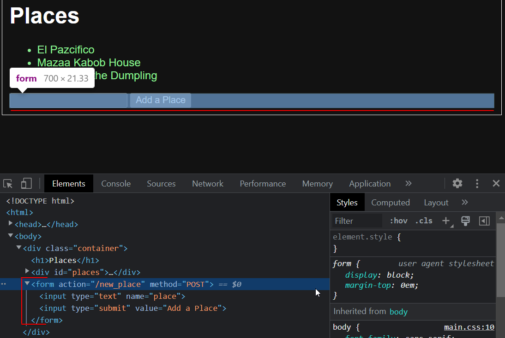

When the button on the form is clicked, the browser will send the user input to the server.
Let's open the ***Network*** tab and see what submitting the form looks like:

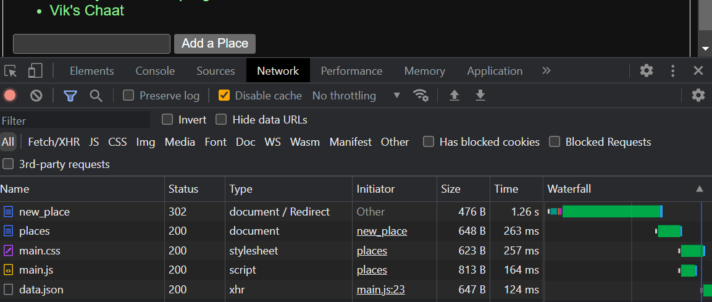

Surprisingly, submitting the form causes no less than **five** HTTP requests.
The first one is the ***form submit event***.
Let's zoom into it:


It is an [HTTP POST](https://developer.mozilla.org/en-US/docs/Web/HTTP/Methods/POST) request to the server address ***new_place***.
The server responds with HTTP status code 302.
This is a [URL redirect](https://en.wikipedia.org/wiki/URL_redirection),
with which the server asks the browser to do a new HTTP GET request to the address defined in the header's *Location* - the address `places`.

So, the browser reloads the *places* page.
The reload causes three more HTTP requests: fetching the style sheet (*main.css*),
the JavaScript code (*main.js*), and the raw data of the places (*data.json*).

We can also see the data submitted in the Network tab.
The Form Data dropdown is within the new Payload tab, located to the right of the Headers tab.


The Form tag has attributes `action` and `method`, which define that submitting the form is done as an HTTP POST request to the address ***new_place***.

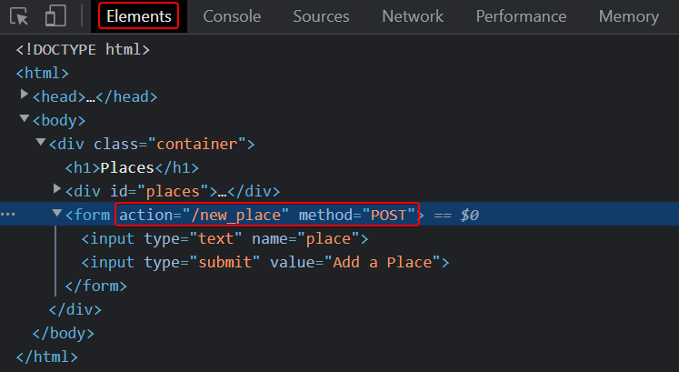

The code on the server responsible for the POST request is quite simple (NB: this code is on the server, and not on the JavaScript code fetched by the browser):

```js
app.post('/new_place', (req, res) => {
  places.push({
    name: req.body.place,
    date: new Date(),
  })

  return res.redirect('/places')
})
```

Data is sent as the [body](https://developer.mozilla.org/en-US/docs/Web/HTTP/Methods/POST) of the POST request.

The server can access the data by accessing the `req.body` field of the request object `req`.

The server creates a new `place` object and adds it to an array called `places`.

```js
places.push({
  name: req.body.place,
  date: new Date(),
})
```

The `place` objects have two fields:

1. a `name` containing the actual name of the place, and
2. a `date` containing the date and time the place was created.

*The server does not save new places to a database, so new places disappear when the server is restarted.*

### AJAX

The places page of the application follows an early-nineties style of web development and uses "Ajax".
As such, it's on the crest of the wave of early 2000s web technology.

[**AJAX**](https://en.wikipedia.org/wiki/Ajax_(programming)) (Asynchronous JavaScript and XML)
is a term introduced in February 2005 on the back of advancements in browser technology to describe a new revolutionary approach.
AJAX enables the fetching of content to web pages using JavaScript included within the HTML, without the need to rerender the page.

Before the AJAX era, all web pages worked like the
[traditional web application](/part0/fundamentals_of_web_apps#traditional-web-applications)
we saw earlier in this chapter.
All of the data shown on the page was fetched with the HTML code generated by the server.

The *places* page uses AJAX to fetch the `places` data.
Submitting the form still uses the traditional mechanism of submitting web forms.

The application URLs reflect the [old, carefree times](https://www.youtube.com/watch?v=GA8z7f7a2Pk).
JSON data is fetched from the URL <https://227demo.djosv.com/data.json>
and new places are sent to the URL <https://227demo.djosv.com/new_place>.
Nowadays URLs like these would not be considered acceptable,
as they don't follow the generally acknowledged conventions of [RESTful](https://en.wikipedia.org/wiki/Representational_state_transfer#Applied_to_web_services) APIs,
which we'll look into more in [part 3](/part3).

The term AJAX is now so commonplace that it's taken for granted.
The term, like *shindig* and *home skillet*, has faded out of our collective consciousness.

### Single page app

In our example app, the home page works like a traditional webpage: All of the logic is on the server, and the browser only renders the HTML as instructed.

The *places* page gives some of the responsibility, generating the HTML code for existing places, to the browser.
The browser tackles this job by executing the JavaScript code it fetched from the server.
The code fetches the places from the server as JSON data and adds HTML elements for displaying the `places` on the page using the [DOM-API](/part0/fundamentals_of_web_apps#document-object-model-or-dom).

In recent years, the [Single-page application](https://en.wikipedia.org/wiki/Single-page_application) (SPA) style of creating web applications has emerged.
SPA-style websites don't fetch all of their pages separately from the server like our sample application does,
but instead comprise only one HTML page fetched from the server,
the contents of which are manipulated with JavaScript that executes in the browser.

The Places page of our application bears some resemblance to SPA-style apps, but it's not quite there yet.
Even though the logic for rendering the places is run on the browser, the page still uses the traditional way of adding new places.
The data is sent to the server via the form's *submit*, and the server instructs the browser to reload the Places page with a *redirect*.

A single-page app version of our example application can be found at <https://227demo.djosv.com/spa>.
At first glance, the application looks the same as the previous one.
The HTML code is almost identical, but the JavaScript file is different (*spa.js*) and there is a small change in how the form tag is defined:

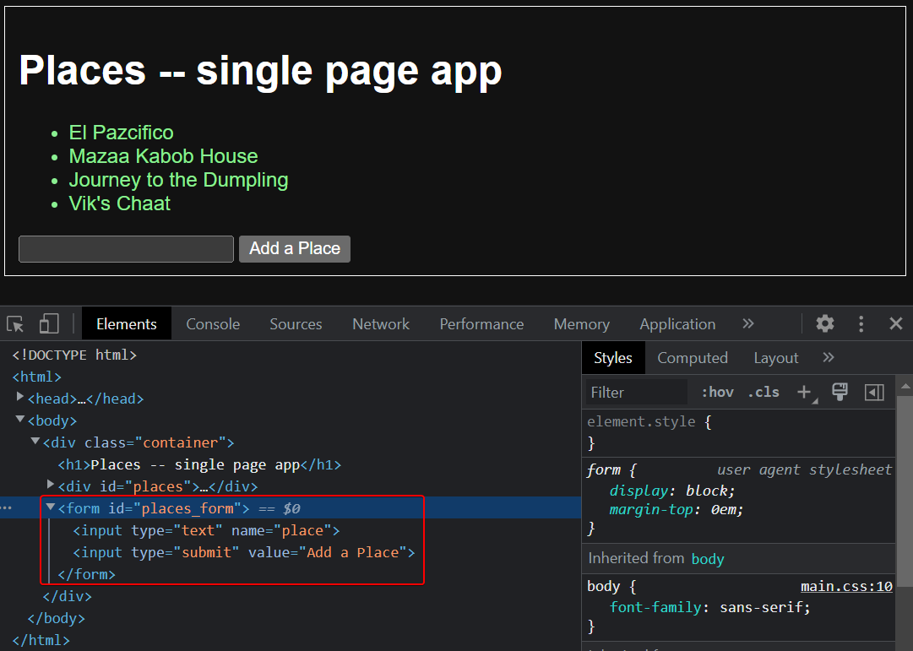

The form has no `action` or `method` attributes to define how and where to send the input data.

Open the ***Network*** tab and empty it.
When you now create a new place, you'll notice that the browser sends only one request to the server.


The POST request to the address `new_place_spa` contains the new place as JSON data containing both the name of the place (`name`) and the timestamp (`date`):

```js
{
  name: "Papa Urb's Grill",
  date: "2023-01-15T15:15:59.905Z"
}
```

The **Content-Type** header of the request tells the server that the included data is represented in JSON format.


Without this header, the server would not know how to correctly parse the data.

The server responds with status code [201 created](https://httpstatuses.com/201).
This time the server does not ask for a redirect, the browser stays on the same page, and it sends no further HTTP requests.

The SPA version of the app does not traditionally send the form data.
Instead, it uses the JavaScript code it fetched from the server.
We'll look into this code a bit, even though understanding all the details of it is not important just yet.

```js
var form = document.getElementById('places_form')
form.onsubmit = function(e) {
  e.preventDefault()

  var place = {
    name: e.target.elements[0].value,
    date: new Date(),
  }

  places.push(place)
  e.target.elements[0].value = ''
  redrawPlaces()
  sendToServer(place)
}
```

The command `document.getElementById('places_form')` instructs the code to fetch the form element from the page and to register an ***event handler*** to handle the form's submit event.
The event handler immediately calls the method `e.preventDefault()` to prevent the default handling of the form's submit.
The default method would send the data to the server and cause a new GET request, which we don't want to happen.

Then the event handler:

1. creates a new place
2. adds it to `places` with the command `places.push(place)`
3. rerenders the webpage's list and
4. sends the new place to the server.

The code for sending the place to the server is as follows:

```js
var sendToServer = function(place) {
  var xhttpForPost = new XMLHttpRequest()
  // ...

  xhttpForPost.open('POST', '/new_place_spa', true)
  xhttpForPost.setRequestHeader(
    'Content-type', 'application/json'
  )
  xhttpForPost.send(JSON.stringify(place))
}
```

The code determines that the data is to be sent with an HTTP POST request and the data type is to be JSON.
The data type is determined with a *Content-type* header.
Then the data is sent as a JSON string.

The application code is available at <https://github.com/comp227/example_app>.
It's worth remembering that the application is only meant to demonstrate the concepts of the course.
The code follows a poor style of development in some measures, and should not be used as an example when creating your applications.
The same is true for the URLs used.
The URL `new_place_spa` that new places are sent to, does not adhere to current best practices.

### JavaScript Libraries

The sample app is done with so-called [**vanilla JavaScript**](https://www.freecodecamp.org/news/is-vanilla-javascript-worth-learning-absolutely-c2c67140ac34/),
using only the DOM-API and JavaScript to manipulate the structure of the pages.

Instead of using JavaScript and the DOM-API only, many popular libraries provide tools that make it easier to manipulate pages compared to the DOM-API.
One of these libraries is the *ever-so-popular* [**jQuery**](https://jquery.com/).

A long time ago, web applications traditionally generated HTML pages on the server side when they wanted to add functionality.
Instead, jQuery built itself on top of Javascript to enhance the functionality on the browser side.
One of the reasons for the success of jQuery was its so-called cross-browser compatibility.
The library worked regardless of the browser or the company that made it, so there was no need for browser-specific solutions.
Nowadays using jQuery is not as justified given the advancement of JavaScript,
and the most popular browsers generally support basic functionalities well.

The rise of the single-page app brought several more "modern" ways of web development than jQuery.
The favorite of the first wave of developers was [BackboneJS](http://backbonejs.org/).
After its [launch](https://github.com/angular/angular.js/blob/master/CHANGELOG.md#100-temporal-domination-2012-06-13) in 2012,
Google's [AngularJS](https://angularjs.org/) quickly became almost the de facto standard of modern web development.

However, the popularity of Angular plummeted in October 2014 after the
[Angular team announced that support for version 1 will end](https://web.archive.org/web/20151208002550/https://jaxenter.com/angular-2-0-announcement-backfires-112127.html),
and Angular 2 will not be backwards compatible with the first version.
Angular 2 and the newer versions have not gotten too warm of a welcome.

Currently, one of the most popular tools for implementing the browser-side logic of web applications is Facebook's [React](https://reactjs.org/) library.
During this course, we will get familiar with React and other technologies which are frequently used together.

The status of React seems strong, but the world of JavaScript is ever-changing.
For example, while [VueJS](https://vuejs.org/) has been around a while as an "up-and-comer",
there are other frameworks like [Svelte](https://svelte.dev/) and [Qwik](https://qwik.build.io) that have recently started generating buzz.
While we have been talking about SPA, there is also talk about [returning more components back to the server](https://dev.to/this-is-learning/the-return-of-server-side-routing-b05).

### Full-stack web development

What does the term - *Full-stack web development* - mean?
**Full stack** is a buzzword.
It's ubiquitous yet devoid of any meaning.
Let's try to provide some context for how the word ends up relating to the term stack.

Practically all web applications have (at least) two "layers":

1. the browser, which is closer to the end-user (AKA the top layer, and
2. the server, whose layer is typically below the browser's

There is often also a database layer below the server.
We can therefore think of the **architecture** of a web application as a kind of **stack** of layers.

Often, we also talk about the [frontend and the backend](https://en.wikipedia.org/wiki/Front_and_back_ends).
The browser is the frontend, and JavaScript that runs on the browser is frontend code.
The server on the other hand is the backend.

In the context of this course, full-stack web development means that we focus on all parts of the application: the frontend, the backend, and the database.
Sometimes the software on the server and its operating system are seen as parts of the stack, but we won't go into those.

We will code the backend with JavaScript, using the [Node.js](https://nodejs.org/en/) runtime environment.
Using the same programming language on multiple layers of the stack gives full-stack web development a whole new dimension.
However, it's not a requirement of full-stack web development to use the same programming language (JavaScript) for all layers of the stack.

It used to be more common for developers to specialize in one layer of the stack, for example, the backend.
Technologies on the backend and the frontend were quite different.
With the Full stack trend, it has become common for developers to be proficient in all layers of the application and the database.
Oftentimes, full-stack developers must also have enough configuration and administration skills to operate their applications, for example, in the cloud.

### JavaScript fatigue

Full-stack web development is challenging in many ways.
Things are happening in many places at once, and debugging is quite a bit harder than with regular desktop applications.
JavaScript does not always work as you'd expect it to (compared to many other languages),
and the asynchronous way its runtime environments work causes all sorts of challenges.
Communicating on the web requires knowledge of the HTTP protocol.
One must also handle databases and server administration and configuration.
It would also be good to know enough CSS to make applications at least somewhat presentable.

The world of JavaScript develops fast, which brings its own set of challenges.
Tools, libraries and the language itself are under constant development.
Some are starting to get tired of the constant change, and have coined a term for it: **JavaScript fatigue**.
See [How to Manage JavaScript Fatigue on auth0](https://auth0.com/blog/how-to-manage-javascript-fatigue/) or
[JavaScript fatigue on Medium](https://medium.com/@ericclemmons/javascript-fatigue-48d4011b6fc4).

You will suffer from JavaScript fatigue yourself during this course.
Fortunately for us, there are a few ways to smooth the learning curve, and we will concentrate on the coding instead of the configuration.
We can't avoid configuration completely
(and we'll be doing some of that in part c),
but after that, we can merrily push ahead in the next few weeks while hopefully avoiding the worst of it.

</div>

<div class="tasks">

### Exercises 0.1-0.6

The exercises are submitted through GitHub and marking them as done on Canvas.

You will submit all of the exercises into the repository that you will be provided in part C GitHub.
While we wait to do those parts, though, **please start doing these exercises first**.

For now, *create a folder called part0 and put all of your work in there until you have the tools that we'll go over in the next section*.

#### 0.1: HTML

Review the basics of HTML by reading this tutorial from Mozilla: [**HTML tutorial**](https://developer.mozilla.org/en-US/docs/Learn/Getting_started_with_the_web/HTML_basics).

This exercise *is not submitted to GitHub*, it's enough to just read the tutorial

#### 0.2: CSS

Review the basics of CSS by reading this tutorial from Mozilla: [CSS tutorial](https://developer.mozilla.org/en-US/docs/Learn/Getting_started_with_the_web/CSS_basics).

This exercise *is not submitted to GitHub*, it's enough to just read the tutorial

#### 0.3: HTML forms

Learn about the basics of HTML forms by reading Mozilla's tutorial [Your first form](https://developer.mozilla.org/en-US/docs/Learn/HTML/Forms/Your_first_HTML_form).

This exercise *is not submitted to GitHub*, it's enough to just read the tutorial

#### 0.4: New place diagram

In the section [Loading a page containing JavaScript - review](/part0/fundamentals_of_web_apps#loading-a-page-containing-java-script-review),
the chain of events caused by opening the page <https://227demo.djosv.com/places>
is depicted as a [sequence diagram](https://developer.ibm.com/articles/the-sequence-diagram/)

The diagram was made using the [web sequence diagrams](https://plantuml.com/sequence-diagram) service as follows:

```bash
@startuml
skinparam sequenceMessageAlign center
Browser -> Server : HTTP GET https://227demo.djosv.com/places
Browser <-- Server : HTML-code
Browser -> Server : HTTP GET https://227demo.djosv.com/main.css
Browser <-- Server : main.css
Browser -> Server : HTTP GET https://227demo.djosv.com/main.js
Browser <-- Server : main.js

note over Browser
 browser starts executing js-code
 that requests JSON data from server
end note

Browser -> Server : HTTP GET https://227demo.djosv.com/data.json
Browser <-- Server : [{ name: "El Pazcifico", date: "2023-01-13"}, ...]

note over Browser
 browser executes the event handler
 that renders the places to display
end note
@enduml
```

**Create a similar diagram** depicting the situation where the user creates a new place on page <https://227demo.djosv.com/places>
when writing something into the text field and clicking the ***submit*** button.

If necessary, show operations on the browser or the server as comments on the diagram.

The diagram does not have to be a sequence diagram.
Any sensible way of presenting the events is fine.

All necessary information for doing this, and the next two exercises, can be found in the text of [this part](/part0/fundamentals_of_web_apps#forms-and-http-post).
The idea of these exercises is to ***read the text through once more and to think through what is going on there***.
Reading the application [code](https://github.com/comp227/example_app) is not necessary, but it is of course possible.

**Notice** perhaps the best way to do diagrams is the [Mermaid](https://github.com/mermaid-js/mermaid#sequence-diagram-docs---live-editor)
syntax that is now implemented in [GitHub](https://github.blog/2022-02-14-include-diagrams-markdown-files-mermaid/) markdown pages!

#### 0.5: Single-page app diagram

Create a diagram depicting the situation where the user goes to the [single-page app](/part0/fundamentals_of_web_apps#single-page-app)
version of the places app at <https://227demo.djosv.com/spa>.

#### 0.6: New place in Single-page app diagram

Create a diagram depicting the situation where the user creates a new place using the single-page version of the app.

This was the last exercise, so please hold on to them until we reach part d and then you can submit your answers there.

</div>
