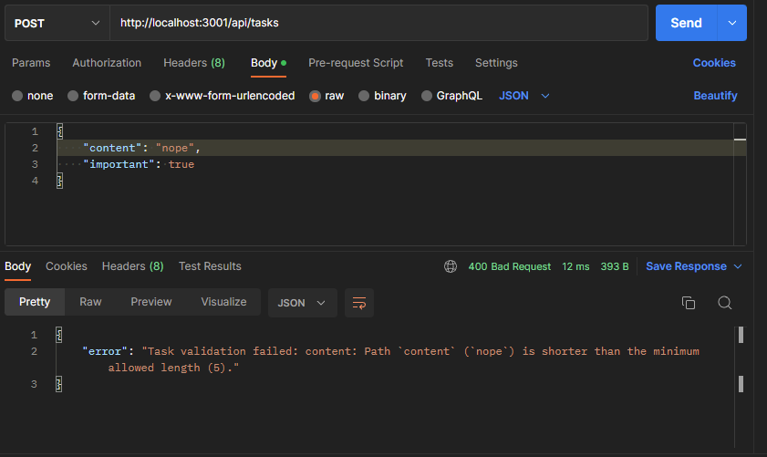
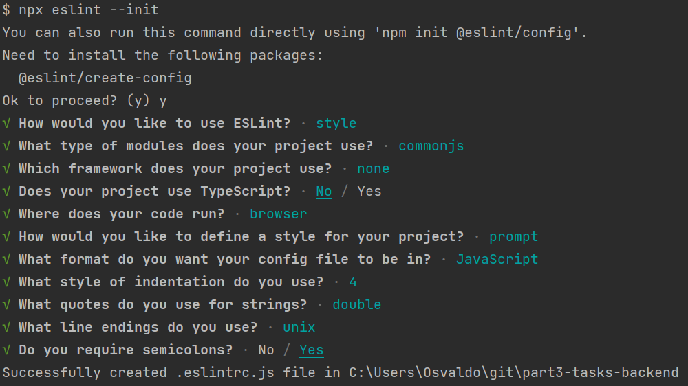
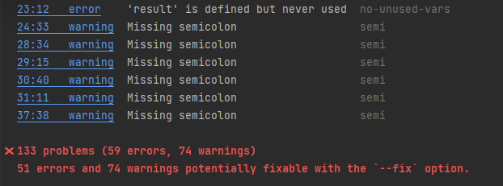
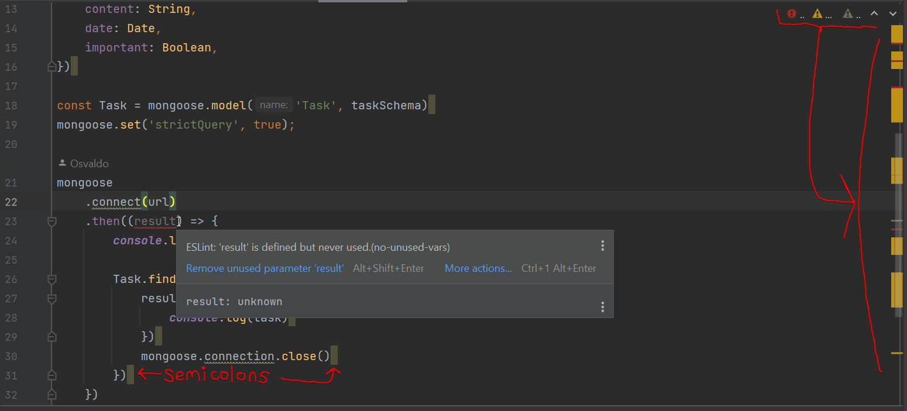

<div class="content">

There are usually constraints that we want to apply to the data that is stored in our application's database.
As an example, our application shouldn't accept tasks that have a missing or empty `content` property.
The validity of the task is checked in the route handler:

```js
app.post('/api/tasks', (request, response) => {
  const body = request.body
  // highlight-start
  if (body.content === undefined) {
    return response.status(400).json({ error: 'content missing' })
  }
  // highlight-end

  // ...
})
```

If the task does not have the `content` property, we respond to the request with the status code **400 bad request**.

One smarter way of validating the format of the data before it is stored in the database is to use the
[validation](https://mongoosejs.com/docs/validation.html) functionality available in Mongoose.

We can define specific validation rules for each field in the schema:

```js
const taskSchema = new mongoose.Schema({
  // highlight-start
  content: {
    type: String,
    minLength: 5,
    required: true
  },
  date: { 
    type: Date,
    required: true
  },
  // highlight-end
  important: Boolean
})
```

The `content` field is now required to be at least five characters long.
The `date` field is set as required, meaning that it can not be missing.
The same constraint is also applied to the `content` field since the minimum length constraint allows the field to be missing.
We have not added any constraints to the `important` field, so its definition in the schema has not changed.

The `minLength` and `required` validators are [built-in](https://mongoosejs.com/docs/validation.html#built-in-validators) and provided by Mongoose.
The Mongoose [custom validator](https://mongoosejs.com/docs/validation.html#custom-validators) functionality
allows us to create new validators if none of the built-in ones cover our needs.

If we try to store an object in the database that breaks one of the constraints, the operation will throw an exception.
Let's change our handler for creating a new task so that it passes any potential exceptions to the error handler middleware:

```js
app.post('/api/tasks', (request, response, next) => { // highlight-line
  const body = request.body

  const task = new Task({
    content: body.content,
    important: body.important || false,
    date: new Date(),
  })

  task.save()
    .then(savedTask => {
      response.json(savedTask)
    })
    .catch(error => next(error)) // highlight-line
})
```

Let's expand the error handler to deal with these validation errors:

```js
const errorHandler = (error, request, response, next) => {
  console.error(error.message)

  if (error.name === 'CastError') {
    return response.status(400).send({ error: 'malformatted id' })
  } else if (error.name === 'ValidationError') { // highlight-line
    return response.status(400).json({ error: error.message }) // highlight-line
  }

  next(error)
}
```

When validating an object fails, we return the following default error message from Mongoose:



We may notice that the backend has now a problem: ***validations are not done when editing a task***.
The [documentation](https://github.com/blakehaswell/mongoose-unique-validator#find--updates) explains what is the problem:
validations are not run by default when `findOneAndUpdate` is executed.

The fix is easy.
Let us also reformulate the route code a bit:

```js
app.put('/api/tasks/:id', (request, response, next) => {
  const { content, important } = request.body // highlight-line

  Task.findByIdAndUpdate(
    request.params.id, 
    { content, important }, // highlight-line
    { new: true, runValidators: true, context: 'query' } // highlight-line
  ) 
    .then(updatedTask => {
      response.json(updatedTask)
    })
    .catch(error => next(error))
})
```

### Deploying the database backend to production

The application should work almost as-is in Render.
We do have to generate a new production build of the frontend since changes thus far were only on our backend.

Render does a nice job in allowing us to keep the environment variables that we want to pull in from production so that it keeps the same structure as our dev environment.
With the secret file, the environment variables we define will be used, so we can try our best to mirror both what is on Render and what we have on our machine.

**The application should now work.**

Sometimes things don't go according to plan.
If there are problems, looking at Render's logs, which are in the left-hand navigation of your web service will help.
As I was going through and working on this, my own application didn't work after making some changes.
Here's what render's logs showed:


In my case, after scrolling through the logs, I noticed that my URL was not defined.
Then I realized that I forgot to save the secret file that I took screenshots of from earlier in this part. 😔
With many of our problems, when we are learning material we sometimes get to problems that feel catastrophic.
Do not despair and stay cool.
Most of the time,
there are simple reasons for our programs behaving in ways that we were hoping wouldn't occur.
Your logs are vital to helping you analyze what could potentially be awry.

You can find the code for our current application in its entirety in the *part3-6* branch of
[this GitHub repository](https://github.com/comp227-hy2019/part3-tasks-backend/tree/part3-6).

</div>

<div class="tasks">

### Exercises 3.19-3.21

#### 3.19*: Communities database, step7

Expand the validation so that the name stored in the database has to be at least three characters long.

Expand the frontend so that it displays some form of error message when a validation error occurs.
Error handling can be implemented by adding a `catch` block as shown below:

```js
groupService
    .create({ ...
})
    .then(createdGroup => {
      // ...
    })
    .catch(error => {
      // this is the way to access the error message
      console.log(error.response.data.error)
    })
```

You can display the default error message returned by Mongoose, even though they are not as readable as they could be:


**NB:** On update operations, mongoose validators are off by default.
[Read the documentation](https://mongoosejs.com/docs/validation.html) to determine how to enable them.

#### 3.20*: Communities database, step8

Add validation to your communities application, which will make sure that community links are of the correct form.

A community link must

- start with `https://` and then either have slack.com or discord.gg as part of its URL.
  The rest of the URL (or subdomain in slack's case) must consist only of letters, numbers or underscores.
    - e.g. <https://pyslackers.slack.com> and and <https://discord.gg/9BXyDG> are valid community links
    - e.g. discord.gg/9BXyDG, <https://reddit.com> and <https://something.discord.gg/9BXyDG> are invalid
- have a unique property that is 6 or more characters.

Use a [Custom validator](https://mongoosejs.com/docs/validation.html#custom-validators) to implement the second part of the validation.

If an HTTP POST request tries to add a name that is already in the communities app,
the server must respond with an appropriate status code and error message.

#### 3.21 Deploying the database backend to production

Generate a new "comp227" version of the application by creating a new production build of the frontend, and copying it to the backend repository.
Verify that everything works locally by using the entire application from the address <http://localhost:3001/>.

Push the latest version to Heroku and verify that everything works there as well.

</div>

<div class="content">

### Lint

Before we move on to the next part, we will take a look at an important tool called [lint](<https://en.wikipedia.org/wiki/Lint_(software)>).
Wikipedia says the following about lint:

> *Generically, lint or a linter is any tool that detects and flags errors in programming languages, including stylistic errors.
  The term lint-like behavior is sometimes applied to the process of flagging suspicious language usage.
  Lint-like tools generally perform static analysis of source code.*

In compiled statically typed languages like Java, IDEs like NetBeans can point out errors in the code, even ones that are more than just compile errors.
Additional tools for performing [static analysis](https://en.wikipedia.org/wiki/Static_program_analysis) like [checkstyle](https://checkstyle.sourceforge.io),
can be used for expanding the capabilities of the IDE to also point out problems related to style, like indentation.

In the JavaScript universe, the current leading tool for static analysis aka.
"linting" is [ESlint](https://eslint.org/).

Let's install ESlint as a development dependency to the backend project with the command:

```bash
npm install eslint --save-dev
```

After this we can initialize a default ESlint configuration with the command:

```bash
npx eslint --init
```

We will answer all of the questions:



The configuration will be saved in the *.eslintrc.js* file:

```js
module.exports = {
    'env': {
        'commonjs': true,
        'es2021': true,
        'node': true
    },
    'extends': 'eslint:recommended',
    'parserOptions': {
        'ecmaVersion': 'latest'
    },
    'rules': {
        'indent': [
            'error',
            4
        ],
        'linebreak-style': [
            'error',
            'unix'
        ],
        'quotes': [
            'error',
            'single'
        ],
        'semi': [
            'error',
            'never'
        ]
    }
}
```

Let's immediately change the rule concerning indentation, so that the indentation level is two spaces.

```js
"indent": [
    "error",
    2
],
```

Inspecting and validating a file like *index.js* can be done with the following command:

```bash
npx eslint index.js
```

It is recommended to create a separate `npm script` for linting:

```json
{
  // ...
  "scripts": {
    "start": "node index.js",
    "dev": "nodemon index.js",
    // ...
    "lint": "eslint ." // highlight-line
  },
  // ...
}
```

Now the `npm run lint` command will check every file in the project.

Also, the files in the *build* directory get checked when the command is run.
We do not want this to happen, and we can accomplish this by creating a [.eslintignore](https://eslint.org/docs/user-guide/configuring#ignoring-files-and-directories)
file in the project's root with the following contents:

```bash
build
```

This causes the entire *build* directory to not be checked by ESlint.

Lint has quite a lot to say about our code:



Let's not fix these issues just yet.

A better alternative to executing the linter from the command line is to configure an ***eslint-plugin*** to the editor, that runs the linter continuously.
By using the plugin you will see errors in your code immediately.
You can find more information about the Visual Studio ESLint plugin [here](https://marketplace.visualstudio.com/items?itemName=dbaeumer.vscode-eslint).

The VS Code ESlint plugin will underline style violations with a red line:



This makes errors easy to spot and fix right away.

ESlint has a vast array of [rules](https://eslint.org/docs/rules/) that are easy to take into use by editing the *.eslintrc.js* file.

Let's add the [eqeqeq](https://eslint.org/docs/rules/eqeqeq) rule that warns us, if equality is checked with anything but the triple equals operator.
The rule is added under the `rules` field in the configuration file.

```js
{
  // ...
  'rules': {
    // ...
   'eqeqeq': 'error',
  },
}
```

While we're at it, let's make a few other changes to the rules.

Let's prevent unnecessary [trailing spaces](https://eslint.org/docs/rules/no-trailing-spaces) at the ends of lines,
let's require that [there is always a space before and after curly braces](https://eslint.org/docs/rules/object-curly-spacing),
and let's also demand a consistent use of whitespaces in the function parameters of arrow functions.

```js
{
  // ...
  'rules': {
    // ...
    'eqeqeq': 'error',
    'no-trailing-spaces': 'error',
    'object-curly-spacing': [
        'error', 'always'
    ],
    'arrow-spacing': [
        'error', { 'before': true, 'after': true }
    ]
  },
}
```

Our default configuration takes a bunch of predetermined rules into use from `eslint:recommended`:

```bash
'extends': 'eslint:recommended',
```

This includes a rule that warns about *console.log* commands.
[Disabling](https://eslint.org/docs/user-guide/configuring#configuring-rules) a rule can be accomplished by
defining its "value" as 0 in the configuration file.
Let's do this for the `no-console` rule in the meantime.

```js
{
  // ...
  'rules': {
    // ...
    'eqeqeq': 'error',
    'no-trailing-spaces': 'error',
    'object-curly-spacing': [
        'error', 'always'
    ],
    'arrow-spacing': [
        'error', { 'before': true, 'after': true }
    ],
    'no-console': 0 // highlight-line
  },
}
```

**NB** when you make changes to the *.eslintrc.js* file, it is recommended to run the linter from the command line.
This will verify that the configuration file is correctly formatted:


If there is something wrong in your configuration file, the lint plugin can behave quite erratically.

Many companies define coding standards that are enforced throughout the organization through the ESlint configuration file.
It is not recommended to keep reinventing the wheel over and over again,
and it can be a good idea to adopt a ready-made configuration from someone else's project into yours.
Recently many projects have adopted the Airbnb [Javascript style guide](https://github.com/airbnb/javascript)
by taking Airbnb's [ESlint](https://github.com/airbnb/javascript/tree/master/packages/eslint-config-airbnb) configuration into use.

You can find the code for our current application in its entirety in the *part3-7* branch of
[this GitHub repository](https://github.com/comp227/part3-tasks-backend/tree/part3-7).
</div>

<div class="tasks">

### Exercise 3.22

#### 3.22: Lint configuration

Add ESlint to your application and fix all the warnings.

This was the last exercise of this part of the course. It's time to push your code to GitHub if you haven't already and mark the exercises that were completed on Canvas.

</div>
