<div class="content">

Back in [part 2](/part2/), we examined two different ways of adding styles to our application:
the old-school [single CSS](/part2/adding_styles_to_react_app) file and [inline styles](/part2/adding_styles_to_react_app#inline_styles).
In this part, we will take a look at a few other ways.

### Ready-made UI libraries

One approach to defining styles for an application is to use a ready-made "UI framework".

One of the first widely popular UI frameworks was the [Bootstrap](https://getbootstrap.com/) toolkit
created by Twitter which may still be the most popular framework.
Recently, there has been an explosion in the number of new UI frameworks that have entered the arena.
The selection is so vast that there is little hope of creating an exhaustive list of options.

Many UI frameworks provide developers of web applications with ready-made themes and "components" like buttons, menus, and tables.
We write components in quotes because, in this context, we are not talking about React components.
Usually, UI frameworks are used by including the CSS stylesheets and JavaScript code of the framework in the application.

Many UI frameworks have React-friendly versions where the framework's "components" have been transformed into React components.
There are a few different React versions of Bootstrap like [reactstrap](http://reactstrap.github.io/) and [react-bootstrap](https://react-bootstrap.github.io/).

To start off, we will examine two UI frameworks, Bootstrap and [MaterialUI](https://mui.com/).
We will use both frameworks to add similar styles to the application we made in the [React-router](/part7/react_router) section of the course material.

### React Bootstrap

Let's start by taking a look at Bootstrap with the help of the [react-bootstrap](https://react-bootstrap.github.io/) package.

Let's install the package with the command:

```bash
npm install react-bootstrap
```

Then let's add a `link` for [loading a Bootstrap CSS stylesheet](https://react-bootstrap.github.io/getting-started/introduction#stylesheets)
inside of the *`head`* tag in the *public/index.html* file of the application:

```js
<head>
  <link
    rel="stylesheet"
    href="https://cdn.jsdelivr.net/npm/bootstrap@5.2.3/dist/css/bootstrap.min.css"
    integrity="sha384-rbsA2VBKQhggwzxH7pPCaAqO46MgnOM80zW1RWuH61DGLwZJEdK2Kadq2F9CUG65"
    crossorigin="anonymous"
  />
  // ...
</head>
```

When we reload the application, we notice that it already looks a bit more stylish:

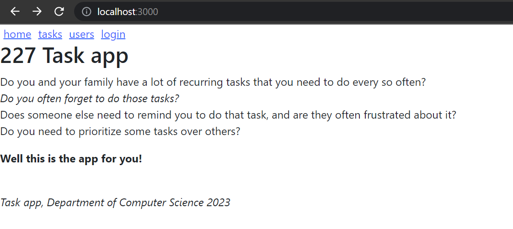

In Bootstrap, all of the contents of the application are typically rendered inside a [container](https://getbootstrap.com/docs/4.1/layout/overview/#containers).
In practice this is accomplished by giving the root `div` element of the application the `container` class attribute:

```js
const App = () => {
  // ...

  return (
    <div className="container"> // highlight-line
      // ...
    </div>
  )
}
```

We notice that this already affected the appearance of the application.
The content is no longer as close to the edges of the browser as it was earlier:

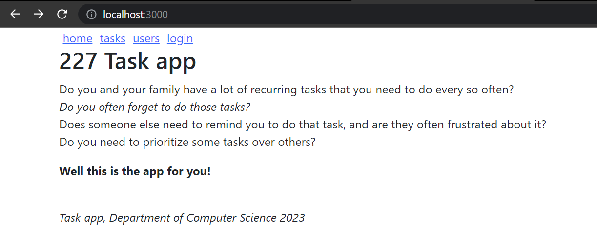

#### Bootstrap Table

Next, let's make some changes to the `Tasks` component so that it renders the list of tasks as a [table](https://getbootstrap.com/docs/4.1/content/tables/).
React Bootstrap provides a built-in [Table](https://react-bootstrap.github.io/components/table/) component for this purpose,
so there is no need to define CSS classes separately.

```js
const Tasks = ({ tasks }) => (
  <div>
    <h2>Tasks</h2>
    <Table striped> // highlight-line
      <tbody>
        {tasks.map(task =>
          <tr key={task.id}>
            <td>
              <Link to={`/tasks/${task.id}`}>
                {task.content}
              </Link>
            </td>
            <td>
              {task.user}
            </td>
          </tr>
        )}
      </tbody>
    </Table>
  </div>
)
```

Notice that the React Bootstrap components have to be imported separately from the library as shown below:

```js
import { Table } from 'react-bootstrap'
```

The appearance of the application is a tad bit more stylish:

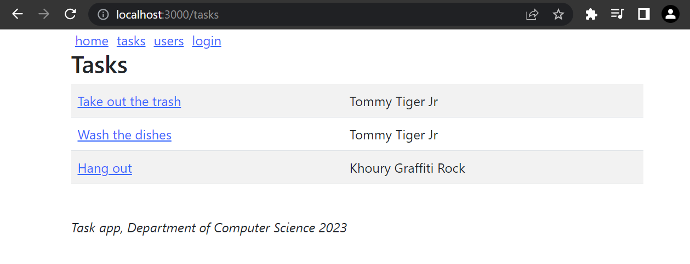

#### Form in Bootstrap

Let's improve the form in the `Login` view with the help of Bootstrap [forms](https://getbootstrap.com/docs/4.1/components/forms/).

React Bootstrap provides built-in [components](https://react-bootstrap.github.io/forms/overview/)
for creating forms (although the documentation for them is slightly lacking):

```js
let Login = (props) => {
  // ...
  return (
    <div>
      <h2>login</h2>
      <Form onSubmit={onSubmit}>
        <Form.Group>
          <Form.Label>username:</Form.Label>
          <Form.Control
            type="text"
            name="username"
          />
          <Form.Label>password:</Form.Label>
          <Form.Control
            type="password"
          />
          <Button variant="primary" type="submit">
            login
          </Button>
        </Form.Group>
      </Form>
    </div>
  )
}
```

For this to work, you'll need to import the following (or simply follow Webstorm's lead and have it import these for you via its context actions):

```js
import { Table, Form, Button } from 'react-bootstrap'
```

After switching over to the Bootstrap form, our improved application looks like this:

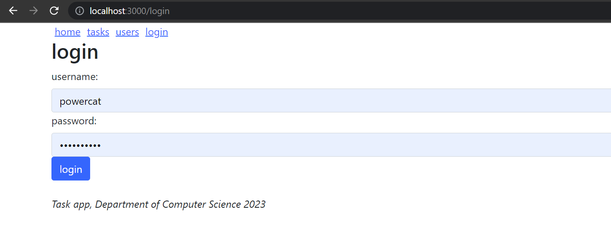

#### Notification in Bootstrap

Now that the login form is in better shape, let's take a look at improving our application's notifications:

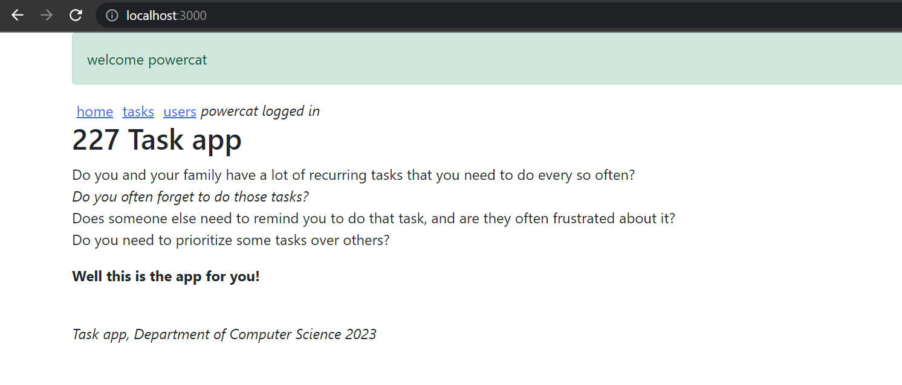

Let's add a message for the notification when a user logs into the application.
We will start by storing a `message` variable in the `App` component's state:

```js
const App = () => {
  const [tasks, setTasks] = useState([
    // ...
  ])

  const [user, setUser] = useState(null)
  const [message, setMessage] = useState(null) // highlight-line

  const login = (user) => {
    setUser(user)
    // highlight-start
    setMessage(`welcome ${user}`)
    setTimeout(() => {
      setMessage(null)
    }, 10000)
    // highlight-end
  }
  // ...
}
```

We will then *render the message as a Bootstrap [Alert](https://getbootstrap.com/docs/4.1/components/alerts/) component*.
Once again, the React Bootstrap library provides us with a matching [React component](https://react-bootstrap.github.io/components/alerts/):

```js
<div className="container">
// highlight-start
  {(message &&
    <Alert variant="success">
      {message}
    </Alert>
  )}
// highlight-end
  // ...
</div>
```

You'll need to import the Alert library from react-bootstrap as well here.

#### Navigation structure in Bootstrap

Lastly, let's alter the application's navigation menu to use Bootstrap's [Navbar](https://getbootstrap.com/docs/4.1/components/navbar/) component.
The React Bootstrap library provides us with [matching built-in components](https://react-bootstrap.github.io/components/navbar/#navbars-mobile-friendly).
Through trial and error, we end up with a working solution despite the cryptic documentation, replacing our existing navigation links.

```js
<Navbar collapseOnSelect expand="lg" bg="dark" variant="dark">
  <Navbar.Toggle aria-controls="responsive-navbar-nav" />
  <Navbar.Collapse id="responsive-navbar-nav">
    <Nav className="me-auto">
      <Nav.Link href="#" as="span">
        <Link style={padding} to="/">home</Link>
      </Nav.Link>
      <Nav.Link href="#" as="span">
        <Link style={padding} to="/tasks">tasks</Link>
      </Nav.Link>
      <Nav.Link href="#" as="span">
        <Link style={padding} to="/users">users</Link>
      </Nav.Link>
      <Nav.Link href="#" as="span">
        {user
          ? <em style={padding}>{user} logged in</em>
          : <Link style={padding} to="/login">login</Link>
        }
      </Nav.Link>
    </Nav>
  </Navbar.Collapse>
</Navbar>
```

The resulting layout has a new appearance:


If the browser window is narrowed, notice how the menu "collapses" into the "hamburger" icon:

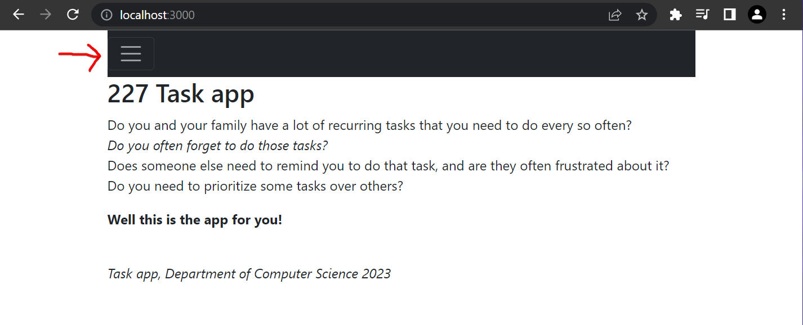

Bootstrap and a large majority of existing UI frameworks produce [**responsive designs**](https://en.wikipedia.org/wiki/Responsive_web_design),
meaning that the resulting applications render well on a variety of different screen sizes.

Chrome's developer tools make it possible to simulate using our application in the browser of different mobile clients:

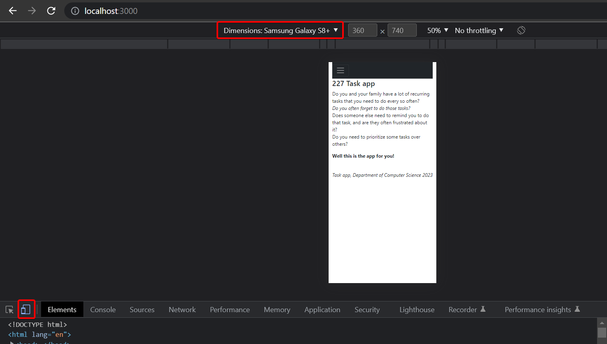

You can find the complete code for the application [here](https://github.com/comp227/misc/blob/main/tasks-bootstrap.js).

### Material UI

As our second example, we will look into the [MaterialUI](https://mui.com/) React library,
which implements the [Material Design](https://material.io/) visual language developed by Google.

For this part, we will reset our javascript file and reset it with the contents that we previously had before we added the bootstrap libraries,
which you can [retrieve from GitHub](https://github.com/comp227/misc/blob/main/tasks-starter.js)
I have also removed the bootstrap library, which is nice to do some overall CSS niceties, but we will remove for simplicity sake.

Once you have reset your index.js in your repo, install the MaterialUI library with the command:

```bash
npm install @mui/material @emotion/react @emotion/styled
```

Then add the following line to the *`head`* tag in the *public/index.html* file.
> *Make sure you removed the bootstrap link from before*

The line loads Google's font Roboto.

```js
<head>
  <link rel="stylesheet" href="https://fonts.googleapis.com/css?family=Roboto:300,400,500,700&display=swap" />
  // ...
</head>
```

Now let's use MaterialUI to do the same modifications to the code we did earlier with bootstrap.

Let's start by placing the contents of the App in a MaterialUI [`Container`](https://mui.com/components/container/).
You can do this by replacing the `div className="container"` tag.

```js
import { Container } from '@mui/material'

const App = () => {
  // ...
  const roboto = {
        fontFamily: "Roboto"
  }

  return (
    <Container style={roboto}>
      // ...
    </Container>
  )
}
```

#### MaterialUI Table

Then let's move to the `Tasks` component.
We'll change the current `table` of tasks to a MaterialUI [`Table`](https://mui.com/material-ui/react-table/#simple-table)

```js
const Tasks = ({ tasks }) => (
  <div>
    <h2>Tasks</h2>

    <TableContainer component={Paper}>
      <Table>
        <TableBody>
          {tasks.map(task => (
            <TableRow key={task.id}>
              <TableCell>
                <Link to={`/tasks/${task.id}`}>{task.content}</Link>
              </TableCell>
              <TableCell>
                {task.user}
              </TableCell>
            </TableRow>
          ))}
        </TableBody>
      </Table>
    </TableContainer>
  </div>
)
```

The table looks like so:

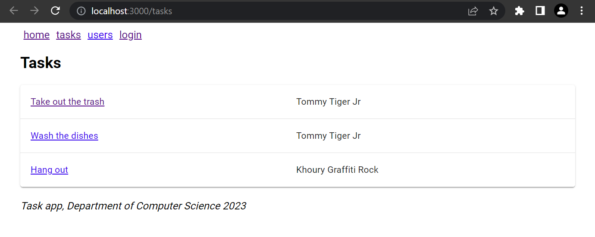

One less pleasant feature of Material UI is that each component has to be imported separately.
The import list for the tasks page is quite long:

```js
import {
  Container,
  Table,
  TableBody,
  TableCell,
  TableContainer,
  TableRow,
  Paper,
} from '@mui/material'
```

#### Form in Material UI

Next, let's make the login form in the `Login` view better using the [TextField](https://mui.com/material-ui/react-text-field/)
and [Button](https://mui.com/material-ui/api/button/) components:

```js
const Login = (props) => {
  const navigate = useNavigate()

  const onSubmit = (event) => {
    event.preventDefault()
    props.onLogin('powercat')
    navigate('/')
  }

  return (
    <div>
      <h2>login</h2>
      <form onSubmit={onSubmit}>
        <div>
          <TextField label="username" />
        </div>
        <div>
          <TextField label="password" type='password' />
        </div>
        <div>
          <Button variant="contained" color="primary" type="submit">
            login
          </Button>
        </div>
      </form>
    </div>
  )
}
```

The result is:


MaterialUI, unlike Bootstrap, does not provide a component for the form itself.
The form here is an ordinary HTML [form](https://developer.mozilla.org/en-US/docs/Web/HTML/Element/form) element.

Remember to import all the components used in the form.

#### Notification in Material UI

The notification displayed on login can be done using the [Alert](https://mui.com/material-ui/react-alert/) component,
which is quite similar to Bootstrap's equivalent component:

```js
<div>
// highlight-start
  {(message &&
    <Alert severity="success">
      {message}
    </Alert>
  )}
// highlight-end
</div>
```

You'll also need to add the setMessage state and timeouts [as we did above](#notification-in-bootstrap)
The alert message looks professional:

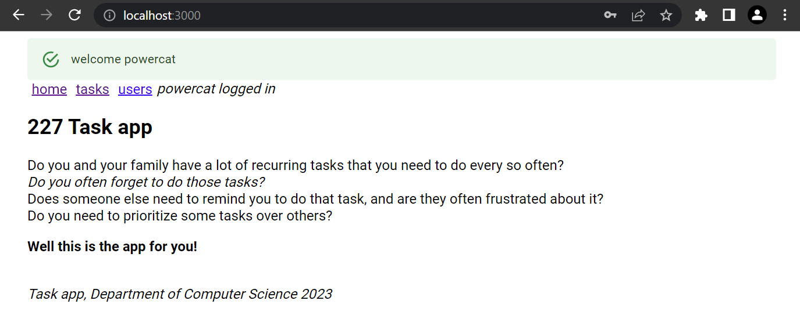

#### Navigation structure in Material UI

We can implement navigation using the [AppBar](https://mui.com/material-ui/react-app-bar/) component.

If we use the example code from the documentation

```js
<AppBar position="static">
  <Toolbar>
    <IconButton edge="start" color="inherit" aria-label="menu">
    </IconButton>
    <Button color="inherit">
      <Link to="/">home</Link>
    </Button>
    <Button color="inherit">
      <Link to="/tasks">tasks</Link>
    </Button>
    <Button color="inherit">
      <Link to="/users">users</Link>
    </Button>  
    <Button color="inherit">
      {user
        ? <em>{user} logged in</em>
        : <Link to="/login">login</Link>
      }
    </Button>                
  </Toolbar>
</AppBar>
```

our navigation works, but it could look better

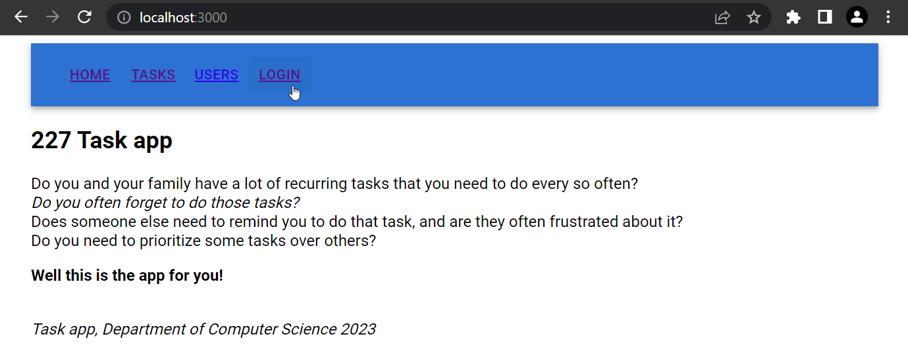

The [documentation](https://mui.com/material-ui/guides/composition/#routing-libraries) provides a better way for us to work through this.
We can use [**component props**](https://mui.com/material-ui/guides/composition/#component-prop) to define *how the root element of a MaterialUI component is rendered*.

By defining

```js
<Button color="inherit" component={Link} to="/">
  home
</Button>
```

the `Button` component is rendered so that its root component is react-router-dom's `Link` which receives its path as the prop field `to`.

The code for the navigation bar is the following:

```js
<AppBar position="static">
  <Toolbar>
    <Button color="inherit" component={Link} to="/">
      home
    </Button>
    <Button color="inherit" component={Link} to="/tasks">
      tasks
    </Button>
    <Button color="inherit" component={Link} to="/users">
      users
    </Button>   
    {user
      ? <em>{user} logged in</em>
      : <Button color="inherit" component={Link} to="/login">
          login
        </Button>
    }                              
  </Toolbar>
</AppBar>
```

and it looks like we want it to:

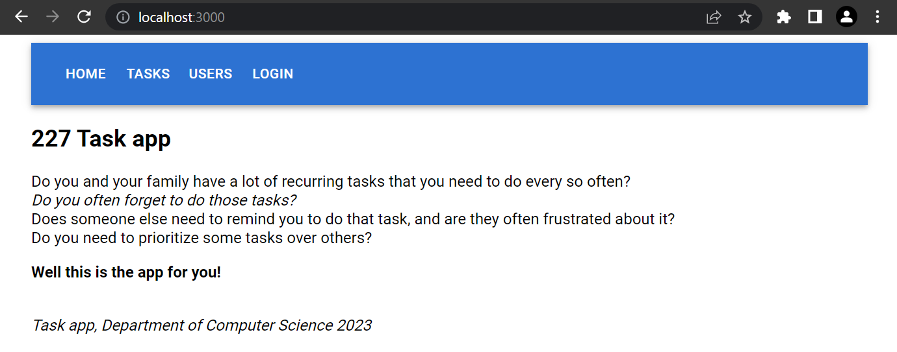

The code of the application can be found [here](https://github.com/comp227/misc/blob/main/tasks-materialui.js).

### Closing thoughts

The difference between *react-bootstrap* and *MaterialUI* is not big.
It's up to you which one you find better looking.
Honestly, I haven't used either extensively, but I see both favorably.
The MaterialUI documentation seems a bit better than react-bootstrap's.
According to <https://www.npmtrends.com/> which tracks the popularity of different npm-libraries, MaterialUI passed react-bootstrap has largely stayed ahead of react bootstrap:


There are other packages that MaterialUI is also split into, which could explain some of the more recent dropoff.

In the two previous examples, we used the UI frameworks with the help of React-integration libraries.

Instead of using the [*React Bootstrap*](https://react-bootstrap.github.io/) library,
we could have just as well used Bootstrap directly by defining CSS classes for our application's HTML elements.
Instead of defining the table with the `Table` component:

```js
<Table striped>
  // ...
</Table>
```

We could have used a regular HTML *`table`* and added the required CSS class:

```js
<table className="table striped">
  // ...
</table>
```

The benefit of using the React Bootstrap library is not that evident from this example.

In addition to making the frontend code more compact and readable,
another advantage of using React UI framework libraries is that they *include the JavaScript that is needed to make specific components work*.
Some Bootstrap components require a few unpleasant
[JavaScript dependencies](https://getbootstrap.com/docs/4.1/getting-started/introduction/#js)
that we would prefer not to include in our React applications.

One drawback to using UI frameworks through integration libraries instead of using them "directly" are that ***integration libraries may have unstable APIs and poor documentation***.
The situation with [Semantic UI React](https://react.semantic-ui.com) is a lot better than with many other UI frameworks, as it is an official React integration library.

So why haven't I used either framework extensively?
Mostly because I've done things using CSS.
I was very hesitant to work with CSS originally, but after spending some time understanding it, I've found it suits my needs.
However, for people lacking knowledge in CSS and web design, using these frameworks/tools can be very useful.

### Other UI frameworks

There are plenty of other UI frameworks out there.
I would not spend a lot of time with any of them unless you are extremely curious or have heard a lot about one or the other.
If you do not see your favorite UI framework in the list, please make a pull request to the course material.

- <https://bulma.io/>
- <https://ant.design/>
- <https://get.foundation/>
- <https://chakra-ui.com/>
- <https://tailwindcss.com/>
- <https://semantic-ui.com/>
- <https://mantine.dev/>
- <https://react.fluentui.dev/>
- <https://storybook.js.org>
- <https://www.primefaces.org/primereact/>
- <https://v2.grommet.io>
- <https://blueprintjs.com>
- <https://evergreen.segment.com>
- <https://www.radix-ui.com/>
- <https://react-spectrum.adobe.com/react-aria/index.html>
- <https://master.co/>
- <https://nextui.org/>

### Styled components

There are also [other ways](https://blog.bitsrc.io/5-ways-to-style-react-components-in-2019-30f1ccc2b5b) of styling React applications that we have not yet taken a look at.

The [styled components](https://www.styled-components.com/) library offers an interesting approach for defining styles
through [tagged template literals](https://developer.mozilla.org/en-US/docs/Web/JavaScript/Reference/Template_literals#tagged_templates) that were introduced in ES6.

Let's make a few changes to the styles of our application with the help of styled components.
I'm going to reset again the page using our default starter.
This time I will make sure that we **do not use any stylesheet or font**, so make sure you remove any links to the bootstrap or roboto fonts.
While either of these two links can combine with styled components, we will leave them out for now so you can be sure that everything we have is directly from the styled components.

First, install the package with the command:

```bash
npm install styled-components
```

Then let's define two components with styles:

```js
import styled from 'styled-components'

const Button = styled.button`
  background: lightgray;
  font-size: 1em;
  margin: 1em;
  padding: 0.25em 1em;
  border: 3px solid darkgray;
  border-radius: 8px;
`

const Input = styled.input`
  margin: 0.25em;
`
```

The code above creates styled versions of the *`button`* and *`input`* HTML elements and then assigns them to the `Button` and `Input` variables.

The syntax for defining the styles is quite interesting, as the CSS rules are defined inside of backticks.

The styled components that we defined work exactly like regular *`button`* and *`input`* elements, and they can be used in the same way:

```js
const Login = (props) => {
  // ...
  return (
    <div>
      <h2>login</h2>
      <form onSubmit={onSubmit}>
        <div>
          username:
          <Input /> // highlight-line
        </div>
        <div>
          password:
          <Input type='password' /> // highlight-line
        </div>
        <Button type="submit" primary=''>login</Button> // highlight-line
      </form>
    </div>
  )
}
```

Let's create a few more components for styling that application which will be styled versions of *`div`* elements:

```js
const Page = styled.div`
  background: #EDE7DC;
  font-family: sans-serif;
`

const Navigation = styled.div`
  background: #DCD2CC;
  padding: 1em;
  border-radius: 5px;
  margin-bottom: 1em;
`

const Footer = styled.div`
  background: #CCAFA5;
  padding: 1em;
  border-radius: 30px;
  margin-top: 1em;
`
```

Let's use the components in our application:

```js
const App = () => {
  // ...

  return (
     <Page> // highlight-line
      <Navigation> // highlight-line
        <Link style={padding} to="/">home</Link>
        <Link style={padding} to="/tasks">tasks</Link>
        <Link style={padding} to="/users">users</Link>
        {user
          ? <em>{user} logged in</em>
          : <Link style={padding} to="/login">login</Link>
        }
      </Navigation> // highlight-line
      
      <Routes>
        <Route path="/tasks/:id" element={<Task task={task} />} />  
        <Route path="/tasks" element={<Tasks tasks={tasks} />} />   
        <Route path="/users" element={user ? <Users /> : <Navigate replace to="/login" />} />
        <Route path="/login" element={<Login onLogin={login} />} />
        <Route path="/" element={<Home />} />      
      </Routes>

      <Footer> // highlight-line
        <em>Task app, Department of Computer Science 2023</em>
      </Footer> // highlight-line
    </Page> // highlight-line
  )
}
```

The appearance of the resulting application is shown below:

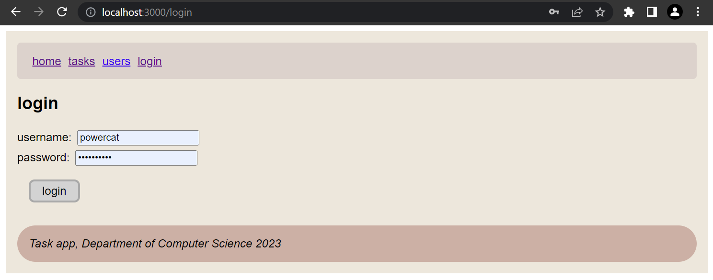

Styled components have seen consistent growth in popularity in recent times,
and quite a lot of people consider it to be the best way of defining styles in React applications.

</div>

<div class="tasks">

### Exercises

The exercises related to the topics presented here can be found at the end of this course material section in the exercise set
[for extending the blog list application](/part7/exercises_extending_the_bloglist).

</div>
