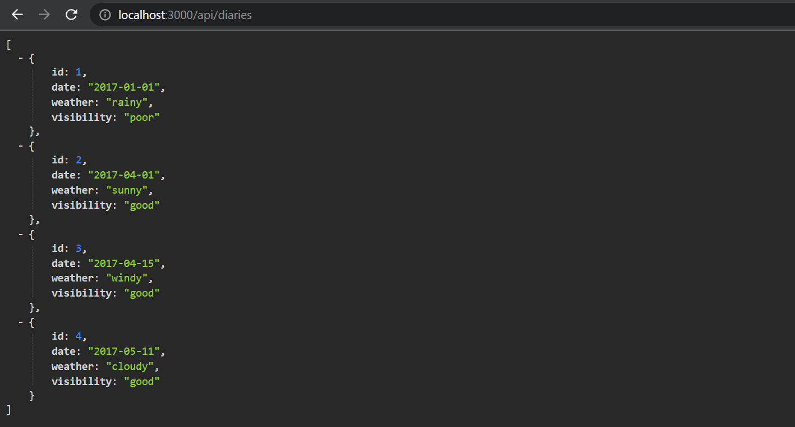
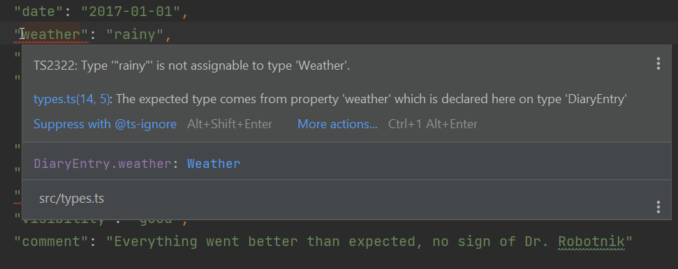

<div class="content">

La interfaz de nuestra aplicación muestra el directorio telefónico muy bien con el servidor actualizado. Sin embargo, si queremos agregar nuevas personas, tenemos que agregar la funcionalidad de inicio de sesión al frontend.

### Inicio de sesión de usuario

<!-- Lisätään sovelluksen tilaan muuttuja _token_, joka tallettaa tokenin siinä vaiheessa kun käyttäjä en kirjautunut. Jos _token_ ei ole määritelty, näytetään kirjautumisesta huolehtiva komponentti <i> LoginForm </i>, joka saa parametriksi virheenkäsittelijän sekä funktion _setToken_: -->
Agreguemos la variable _token_ al estado de la aplicación. Contendrá el token del usuario cuando se inicie sesión. Si _token_ no está definido, representamos el componente <i>LoginForm</i> responsable del inicio de sesión del usuario. El componente recibe un controlador de errores y la función _setToken_ como parámetros:

```js
const App = () => {
  const [token, setToken] = useState(null) // highlight-line

  // ...

  if (!token) {
    return (
      <div>
        <Notify errorMessage={errorMessage} />
        <h2>Login</h2>
        <LoginForm
          setToken={setToken}
          setError={notify}
        />
      </div>
    )
  }

  return (
    // ...
  )
}
```

<!-- Määritellään kirjautumisen suorittava mutaatio -->
A continuación, definimos una mutación para iniciar sesión

```js
export const LOGIN = gql`
  mutation login($username: String!, $password: String!) {
    login(username: $username, password: $password)  {
      value
    }
  }
`
```

<!-- Kirjautumisesta huolehtiva komponentti _LoginForm_ toimii melko samalla tavalla kuin aiemmat mutaatioista huolehtivat komponentit. Mielenkiintoiset rivit en korostettu koodissa: -->
El componente _LoginForm_ funciona de forma muy similar a todos los demás componentes que realizan mutaciones que hemos creado anteriormente.
Se han resaltado líneas interesantes en el código:

```js
import React, { useState, useEffect } from 'react'
import { useMutation } from '@apollo/client'
import { LOGIN } from '../queries'

const LoginForm = ({ setError, setToken }) => {
  const [username, setUsername] = useState('')
  const [password, setPassword] = useState('')

  const [ login, result ] = useMutation(LOGIN, { // highlight-line
    onError: (error) => {
      setError(error.graphQLErrors[0].message)
    }
  })

// highlight-start
  useEffect(() => {
    if ( result.data ) {
      const token = result.data.login.value
      setToken(token)
      localStorage.setItem('phonenumbers-user-token', token)
    }
  }, [result.data]) // eslint-disable-line
// highlight-end

  const submit = async (event) => {
    event.preventDefault()

    login({ variables: { username, password } })
  }

  return (
    <div>
      <form onSubmit={submit}>
        <div>
          username <input
            value={username}
            onChange={({ target }) => setUsername(target.value)}
          />
        </div>
        <div>
          password <input
            type='password'
            value={password}
            onChange={({ target }) => setPassword(target.value)}
          />
        </div>
        <button type='submit'>login</button>
      </form>
    </div>
  )
}

export default LoginForm
```

<!-- Käytössä en jälleen efektihookki, jonka avulla asetetaan tokenin arvo komponentin _App_ tilaan sekä almacenamiento localen siinä vaiheessa kun palvelin en vastannut mutaatioon. Efektihookki sobre tarpeen, jotta sovellus ei joutuisi ikuiseen renderöintilooppiin. -->
Estamos usando un hook de efectos de nuevo. Aquí se usa para guardar el valor del token en el estado del componente _App_ y el almacenamiento local después de que el servidor haya respondido a la mutación.
El uso del hook de efectos es necesario para evitar un bucle de renderizado sin fin.

Agreguemos también un botón que permite a un usuario que ha iniciado sesión cerrar la sesión. El controlador onClick del botón establece el estado _token_ en nulo, elimina el token del almacenamiento local y restablece la caché del cliente Apollo. El último paso es [importante](https://www.apollographql.com/docs/react/networking/authentication/#reset-store-on-logout), porque algunas consultas pueden haber obtenido datos en la caché, que solo los usuarios que iniciaron sesión deben tener acceso.

Podemos restablecer la caché usando el método [resetStore](https://www.apollographql.com/docs/react/api/core/ApolloClient/#ApolloClient.resetStore) de un objeto _client_ de Apollo.
Se puede acceder al cliente con el hook [useApolloClient](https://www.apollographql.com/docs/react/api/react-hooks/#useapolloclient):

```js
const App = () => {
  const [token, setToken] = useState(null)
  const [errorMessage, setErrorMessage] = useState(null)
  const result = useQuery(ALL_PERSONS)
  const client = useApolloClient() // highlight-line

  if (result.loading)  {
    return <div>loading...</div>
  }

  // highlight-start
  const logout = () => {
    setToken(null)
    localStorage.clear()
    client.resetStore()
  }
  // highlight-end

}
```

El código actual de la aplicación se puede encontrar en [Github](https://github.com/fullstack-hy2020/graphql-phonebook-frontend/tree/part8-6), rama <i>part8-6</i>.

### Agregar un token a un encabezado

Después de que el backend cambie, la creación de nuevas personas requiere que se envíe un token de usuario válido con la solicitud. Para enviar el token, tenemos que cambiar un poco la forma en que definimos el objeto _ApolloClient_ en <i>index.js</i>.

```js
import { setContext } from 'apollo-link-context' // highlight-line

// highlight-start
const authLink = setContext((_, { headers }) => {
  const token = localStorage.getItem('phonenumbers-user-token')
  return {
    headers: {
      ...headers,
      authorization: token ? `bearer ${token}` : null,
    }
  }
})
// highlight-end

const httpLink = new HttpLink({ uri: 'http://localhost:4000' }) // highlight-line

const client = new ApolloClient({
  cache: new InMemoryCache(),
  link: authLink.concat(httpLink) // highlight-line
})
```

<!-- _client_-olion muodostamisen yhteydessä oleva toinen parametri _link_ määrittelee, miten apollo on yhteydessä palvelimeen. Nyt normaalia [httpLink] (https://www.apollographql.com/docs/link/links/http.htm) -yhteyttä muokataan siten, että, että pyyntöjen mukaan [asetetaan headerille] (https://www.apollographql.com / docs / react / networking / authentication / # header) <i> autorización </i> arvoksi localStoragessa mahdollisesti oleva token. -->
El parámetro de enlace dado al objeto _client_ define cómo apollo se conecta al servidor. Aquí, la conexión normal de [httpLink](https://www.apollographql.com/docs/link/links/http.htm) se modifica para que el [encabezado](https://www.apollographql.com/docs/react/networking/authentication/#header) <i>authorization</i> contenga el token si se ha guardado uno en localStorage.

<!-- Asennetaan vielä muutoksen tarvitsema kirjasto -->
También necesitamos instalar la librería requerida por esta modificación

```bash
npm install apollo-link-context
```
La creación de nuevas personas y el cambio de números funciona nuevamente. Sin embargo, queda un problema pendiente. Si intentamos agregar una persona sin un número de teléfono, no es posible.


La validación falla, porque el frontend envía una cadena vacía como el valor de _phone_.

Cambiemos la función creando nuevas personas para que establezca _phone_ en nulo si el usuario no ha dado un valor.

```js
const PersonForm = ({ setError }) => {
  // ...
  const submit = async (event) => {
    event.preventDefault()
    createPerson({
      variables: { 
        name, street, city,  // highlight-line
        phone: phone.length > 0 ? phone : null  // highlight-line
      }
    })

  // ...
  }

  // ...
}
```

El código de aplicación actual se puede encontrar en [Github](https://github.com/fullstack-hy2020/graphql-phonebook-frontend/tree/part8-7), rama <i>part8-7</i>.

### Actualizando caché, revisado

Tenemos que [actualizar](/es​​/part8/react*and_graph_ql#update-the-cache) el caché del cliente Apollo al crear nuevas personas. Podemos actualizarlo usando la opción _refetchQueries_ de la mutación para definir que la consulta <em>ALL_PERSONS</em> se realiza nuevamente.

```js 
const PersonForm = ({ setError }) => {
  // ...

  const [ createPerson ] = useMutation(CREATE_PERSON, {
    refetchQueries: [  {query: ALL_PERSONS} ], // highlight-line
    onError: (error) => {
      setError(error.graphQLErrors[0].message)
    }
  })
```

Este enfoque es bastante bueno, el inconveniente es que la consulta siempre se vuelve a ejecutar con las actualizaciones.

Es posible optimizar la solución gestionando la actualización de la caché nosotros mismos. Esto se hace definiendo una llamada de devolución de [actualización](https://www.apollographql.com/docs/react/api/react/hooks/#options) adecuada para la mutación, que Apollo ejecuta después la mutación:

```js 
const PersonForm = ({ setError }) => {
  // ...

  const [ createPerson ] = useMutation(CREATE_PERSON, {
    onError: (error) => {
      setError(error.graphQLErrors[0].message)
    },
    // highlight-start
    update: (store, response) => {
      const dataInStore = store.readQuery({ query: ALL_PERSONS })
      store.writeQuery({
        query: ALL_PERSONS,
        data: {
          ...dataInStore,
          allPersons: [ ...dataInStore.allPersons, response.data.addPerson ]
        }
      })
    }
    // highlight-end
  })
 
  // ..
}  
```

La función de devolución de llamada recibe una referencia al caché y los datos devueltos por la mutación como parámetros. Por ejemplo, en nuestro caso sería la persona creada.

El código lee el estado en caché de la consulta <em>ALL_PERSONS</em> usando [readQuery](https://www.apollographql.com/docs/react/caching/cache-interaction/#readquery) y actualiza el caché con la función [writeQuery](https://www.apollographql.com/docs/react/caching/cache-interaction/#writequery-and-writefragment) agregando la nueva persona a los datos almacenados en caché.

Tenga en cuenta que readQuery arrojará un error si su caché no contiene todos los datos necesarios para cumplir con la consulta especificada. Esto se puede resolver usando un bloque try-catch.

<!-- En myös olemassa tilanteita, joissa ainoa järkevä tapa saada välimuisti pidettyä ajantasaisena en _update_-callbackillä tehtävä päivitys. -->
En algunas situaciones, la única forma sensata de mantener el caché actualizado es usando la devolución de llamada _update_.

Cuando sea necesario, es posible deshabilitar el caché para toda la aplicación o [consultas únicas](https://www.apollographql.com/docs/react/api/react/hooks/#options) configurando el campo que administra el uso del caché , [fetchPolicy](https://www.apollographql.com/docs/react/data/queries/#configuring-fetch-logic) como <em>sin caché</em>.

Sea diligente con el caché. Los datos antiguos en la caché pueden causar errores difíciles de encontrar. Como sabemos, mantener el caché actualizado es un gran desafío. Según un proverbio codificador:

> <i>Solo hay dos cosas difíciles en Ciencias de la Computación: invalidación de caché y nombrar cosas. </i> Leer más [aquí](https://www.google.com/search?q=two+hard+things+in+Computer+Science&oq=two+hard+things+in+Computer+Science).

El código actual de la aplicación se puede encontrar en [Github](https://github.com/fullstack-hy2020/graphql-phonebook-frontend/tree/part8-8), rama <i>part8-8</i>.

</div>

<div class="tasks">

### Ejercicios 8.17.-8.22.

#### 8.17 Listado de libros

Después de que el backend cambia, la lista de libros ya no funciona. Arreglalo.

#### 8.18 Iniciar sesión

Agregar libros nuevos y cambiar el año de nacimiento de un autor no funcionan porque requieren que el usuario inicie sesión.

Aún no es necesario manejar los errores de validación.

Puede decidir cómo se verá el inicio de sesión en la interfaz de usuario. Una posible solución es convertir el formulario de inicio de sesión en una vista separada a la que se puede acceder a través de un menú de navegación



El formulario de inicio de sesión:


Cuando un usuario inicia sesión, la navegación cambia para mostrar las funcionalidades que solo puede realizar un usuario registrado:


#### 8.19 Libros por género, parte 1

Complete su solicitud para filtrar la lista de libros por género. Su solución podría verse así:



En este ejercicio, el filtrado se puede hacer usando solo React.

#### 8.20 Libros por género, parte 2

Implemente una vista que muestre todos los libros según el género favorito del usuario que haya iniciado sesión.


#### 8.21 libros por género con GraphQL

En el ejercicio anterior 8.20, el filtrado podría haberse hecho usando solo React. Para completar este ejercicio, debe filtrar los libros en la página de recomendaciones mediante una consulta GraphQL al servidor. La consulta creada en el ejercicio 8.5 podría ser útil aquí.

Este y los siguientes ejercicios son bastante **desafiantes** como debería ser a esta altura del curso. Es posible que desee completar primero los más fáciles en la [siguiente parte](/es/part8/fragments_and_subscriptions).

Algunos consejos

- En lugar de usar <i>useQuery</i>, probablemente sea mejor hacer las consultas con el hook <i>useLazyQuery</i>
- A veces es útil guardar los resultados de una consulta GraphQL en el estado de un componente.
- Tenga en cuenta que puede realizar consultas GraphQL en un hook <i>useEffect</i>.
- El [segundo parámetro](https://reactjs.org/docs/hooks-reference.html#conditionally-firing-an-effect) de un hook <i>useEffect</i> puede resultar útil dependiendo de su enfoque.

#### 8.22 Caché actualizado y recomendaciones de libros

Si recuperas las recomendaciones de libros con GraphQL, asegúrate de alguna manera de que la vista de libros se mantenga actualizada. Entonces, cuando se agrega un libro nuevo, la vista de libros se actualiza **al menos** cuando se presiona un botón de selección de género.

<i>Cuando no se realiza la selección de un nuevo género, no es necesario actualizar la vista.</i>

</div>
